# ARCHITECTURE.md — NovaCommerce

> **Enterprise Commerce & Intelligence Platform**  
> Phiên bản: 1.0 | Năm 2026
> Kiến trúc: Microservices + Event-Driven + Data Platform + Cloud Native

---

## MỤC LỤC

1. [Tổng quan Kiến trúc](#1-tổng-quan-kiến-trúc)
2. [Network & Security Layer](#2-network--security-layer)
3. [API Gateway & BFF Layer](#3-api-gateway--bff-layer)
4. [Microservices Layer](#4-microservices-layer)
5. [Event Bus — Apache Kafka](#5-event-bus--apache-kafka)
6. [Data Platform Layer](#6-data-platform-layer)
7. [AI & Intelligence Layer](#7-ai--intelligence-layer)
8. [Infrastructure Layer — Kubernetes](#8-infrastructure-layer--kubernetes)
9. [Observability Stack](#9-observability-stack)
10. [CI/CD Pipeline](#10-cicd-pipeline)
11. [Request Flow — Luồng Xử lý Điển hình](#11-request-flow--luồng-xử-lý-điển-hình)
12. [Deployment Architecture](#12-deployment-architecture)
13. [Security Architecture](#13-security-architecture)
14. [Scaling Strategy](#14-scaling-strategy)

---

## 1. Tổng quan Kiến trúc

### 1.1 System Context Diagram (C4 Level 1)

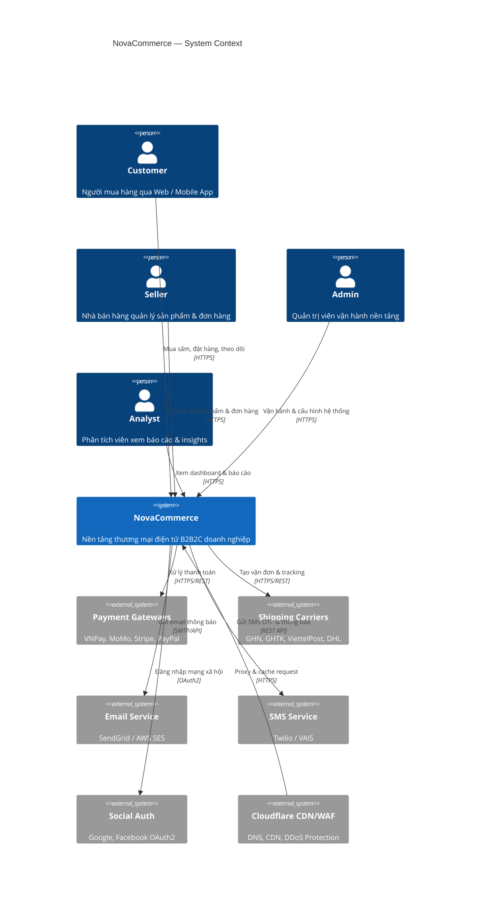
```mermaid
C4Context
    title NovaCommerce — System Context

    Person(customer, "Customer", "Người mua hàng qua Web / Mobile App")
    Person(seller, "Seller", "Nhà bán hàng quản lý sản phẩm & đơn hàng")
    Person(admin, "Admin", "Quản trị viên vận hành nền tảng")
    Person(analyst, "Analyst", "Phân tích viên xem báo cáo & insights")

    System(novacommerce, "NovaCommerce", "Nền tảng thương mại điện tử B2B2C doanh nghiệp")

    System_Ext(payment_gw, "Payment Gateways", "VNPay, MoMo, Stripe, PayPal")
    System_Ext(shipping_co, "Shipping Carriers", "GHN, GHTK, ViettelPost, DHL")
    System_Ext(email_svc, "Email Service", "SendGrid / AWS SES")
    System_Ext(sms_svc, "SMS Service", "Twilio / VAIS")
    System_Ext(social_auth, "Social Auth", "Google, Facebook OAuth2")
    System_Ext(cdn, "Cloudflare CDN/WAF", "DNS, CDN, DDoS Protection")

    Rel(customer, novacommerce, "Mua sắm, đặt hàng, theo dõi", "HTTPS")
    Rel(seller, novacommerce, "Quản lý sản phẩm & đơn hàng", "HTTPS")
    Rel(admin, novacommerce, "Vận hành & cấu hình hệ thống", "HTTPS")
    Rel(analyst, novacommerce, "Xem dashboard & báo cáo", "HTTPS")

    Rel(novacommerce, payment_gw, "Xử lý thanh toán", "HTTPS/REST")
    Rel(novacommerce, shipping_co, "Tạo vận đơn & tracking", "HTTPS/REST")
    Rel(novacommerce, email_svc, "Gửi email thông báo", "SMTP/API")
    Rel(novacommerce, sms_svc, "Gửi SMS OTP & thông báo", "REST API")
    Rel(novacommerce, social_auth, "Đăng nhập mạng xã hội", "OAuth2")
    Rel(cdn, novacommerce, "Proxy & cache request", "HTTPS")
```

### 1.2 High-Level Architecture

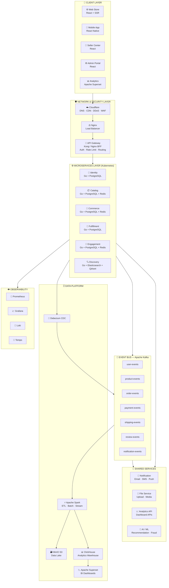
```mermaid
graph TB
    subgraph CLIENTS["👤 CLIENT LAYER"]
        WEB["🌐 Web Store<br/>React + SSR"]
        MOB["📱 Mobile App<br/>React Native"]
        SEL["🏪 Seller Center<br/>React"]
        ADM["⚙️ Admin Portal<br/>React"]
        BI["📊 Analytics<br/>Apache Superset"]
    end

    subgraph NETWORK["🛡️ NETWORK & SECURITY LAYER"]
        CF["☁️ Cloudflare<br/>DNS · CDN · DDoS · WAF"]
        LB["⚖️ Nginx<br/>Load Balancer"]
        GW["🚪 API Gateway<br/>Kong / Nginx BFF<br/>Auth · Rate Limit · Routing"]
    end

    subgraph SERVICES["⚙️ MICROSERVICES LAYER (Kubernetes)"]
        IS["🔐 Identity<br/>Go + PostgreSQL"]
        CS["📦 Catalog<br/>Go + PostgreSQL + Redis"]
        CMS["🛒 Commerce<br/>Go + PostgreSQL + Redis"]
        FS["🚚 Fulfillment<br/>Go + PostgreSQL"]
        ES["💬 Engagement<br/>Go + PostgreSQL + Redis"]
        DS["🔍 Discovery<br/>Go + Elasticsearch + Qdrant"]
    end

    subgraph SHARED["🔧 SHARED SERVICES"]
        NS["📨 Notification<br/>Email · SMS · Push"]
        FLS["📁 File Service<br/>Upload · Media"]
        AS["📈 Analytics API<br/>Dashboard APIs"]
        AI["🤖 AI / ML<br/>Recommendation · Fraud"]
    end

    subgraph KAFKA["📡 EVENT BUS — Apache Kafka"]
        K1["user-events"]
        K2["product-events"]
        K3["order-events"]
        K4["payment-events"]
        K5["shipping-events"]
        K6["review-events"]
        K7["notification-events"]
    end

    subgraph DATA["🗄️ DATA PLATFORM"]
        DEB["🔄 Debezium CDC"]
        SPK["⚡ Apache Spark<br/>ETL · Batch · Stream"]
        MINIO["🗃️ MinIO S3<br/>Data Lake"]
        CH["📊 ClickHouse<br/>Analytics Warehouse"]
        SUP["📉 Apache Superset<br/>BI Dashboards"]
    end

    subgraph OBS["👁️ OBSERVABILITY"]
        PROM["📏 Prometheus"]
        GRAF["📈 Grafana"]
        LOKI["📝 Loki"]
        TEMPO["🔗 Tempo"]
    end

    CLIENTS --> CF
    CF --> LB
    LB --> GW
    GW --> SERVICES
    SERVICES --> KAFKA
    KAFKA --> SHARED
    SERVICES --> SHARED
    SERVICES --> DEB
    DEB --> KAFKA
    KAFKA --> SPK
    SPK --> MINIO
    SPK --> CH
    CH --> SUP
    SERVICES --> OBS
```

---

## 2. Network & Security Layer

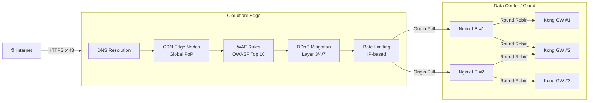
```mermaid
graph LR
    INET["🌐 Internet"]

    subgraph CF_LAYER["Cloudflare Edge"]
        DNS["DNS Resolution"]
        CDN_NODE["CDN Edge Nodes<br/>Global PoP"]
        WAF["WAF Rules<br/>OWASP Top 10"]
        DDOS["DDoS Mitigation<br/>Layer 3/4/7"]
        RATE["Rate Limiting<br/>IP-based"]
    end

    subgraph DC["Data Center / Cloud"]
        LB1["Nginx LB #1"]
        LB2["Nginx LB #2"]
        GW1["Kong GW #1"]
        GW2["Kong GW #2"]
        GW3["Kong GW #3"]
    end

    INET -->|"HTTPS :443"| CF_LAYER
    DNS --> CDN_NODE
    CDN_NODE --> WAF
    WAF --> DDOS
    DDOS --> RATE
    RATE -->|"Origin Pull"| LB1
    RATE -->|"Origin Pull"| LB2
    LB1 -->|"Round Robin"| GW1
    LB1 -->|"Round Robin"| GW2
    LB2 -->|"Round Robin"| GW2
    LB2 -->|"Round Robin"| GW3
```

### Security Controls per Layer

| Layer         | Control                                     | Công nghệ            |
| ------------- | ------------------------------------------- | -------------------- |
| DNS           | DNSSEC, DDoS L3/L4                          | Cloudflare           |
| CDN           | Cache static assets, TLS termination        | Cloudflare           |
| WAF           | Block OWASP Top 10, SQL injection, XSS      | Cloudflare WAF Rules |
| Load Balancer | Health check, TLS passthrough               | Nginx                |
| API Gateway   | JWT validation, Rate limiting, IP whitelist | Kong plugins         |
| Service Mesh  | mTLS giữa services, circuit breaker         | Istio                |
| Application   | RBAC, input validation, audit log           | Gin middleware       |
| Database      | Encryption at rest, least privilege         | PostgreSQL roles     |

---

## 3. API Gateway & BFF Layer

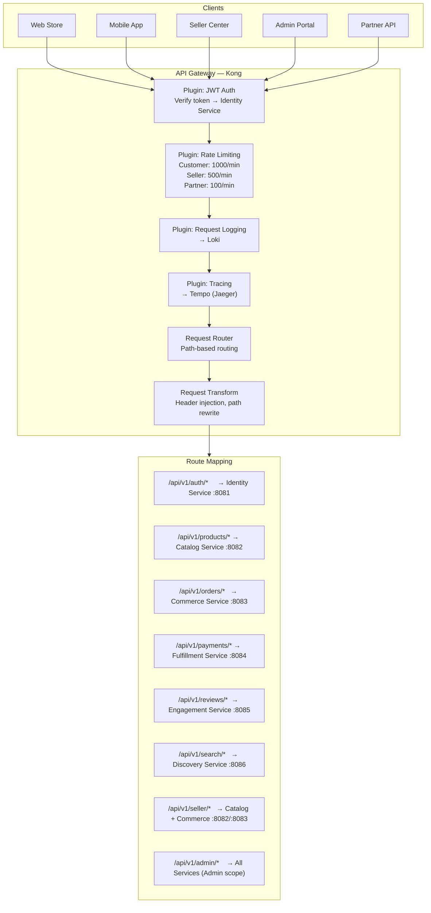
```mermaid
graph TB
    subgraph CLIENTS["Clients"]
        WEB["Web Store"]
        MOB["Mobile App"]
        SEL["Seller Center"]
        ADM["Admin Portal"]
        PARTNER["Partner API"]
    end

    subgraph GW["API Gateway — Kong"]
        direction TB
        AUTH_PLG["Plugin: JWT Auth<br/>Verify token → Identity Service"]
        RATE_PLG["Plugin: Rate Limiting<br/>Customer: 1000/min<br/>Seller: 500/min<br/>Partner: 100/min"]
        LOG_PLG["Plugin: Request Logging<br/>→ Loki"]
        TRACE_PLG["Plugin: Tracing<br/>→ Tempo (Jaeger)"]
        ROUTER["Request Router<br/>Path-based routing"]
        TRANS["Request Transform<br/>Header injection, path rewrite"]
    end

    subgraph ROUTES["Route Mapping"]
        R1["/api/v1/auth/*     → Identity Service :8081"]
        R2["/api/v1/products/* → Catalog Service :8082"]
        R3["/api/v1/orders/*   → Commerce Service :8083"]
        R4["/api/v1/payments/* → Fulfillment Service :8084"]
        R5["/api/v1/reviews/*  → Engagement Service :8085"]
        R6["/api/v1/search/*   → Discovery Service :8086"]
        R7["/api/v1/seller/*   → Catalog + Commerce :8082/:8083"]
        R8["/api/v1/admin/*    → All Services (Admin scope)"]
    end

    WEB & MOB --> AUTH_PLG
    SEL --> AUTH_PLG
    ADM --> AUTH_PLG
    PARTNER --> AUTH_PLG

    AUTH_PLG --> RATE_PLG --> LOG_PLG --> TRACE_PLG --> ROUTER --> TRANS
    TRANS --> ROUTES
```

---

## 4. Microservices Layer

### 4.1 Service Map & Dependencies

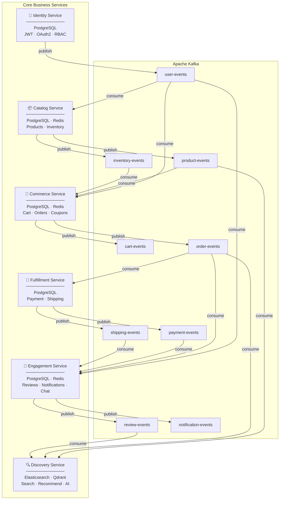
```mermaid
graph TB
    subgraph CORE["Core Business Services"]
        IS["🔐 Identity Service<br/>─────────────<br/>PostgreSQL<br/>JWT · OAuth2 · RBAC"]
        CS["📦 Catalog Service<br/>─────────────<br/>PostgreSQL · Redis<br/>Products · Inventory"]
        CMS["🛒 Commerce Service<br/>─────────────<br/>PostgreSQL · Redis<br/>Cart · Orders · Coupons"]
        FS["🚚 Fulfillment Service<br/>─────────────<br/>PostgreSQL<br/>Payment · Shipping"]
        ES["💬 Engagement Service<br/>─────────────<br/>PostgreSQL · Redis<br/>Reviews · Notifications · Chat"]
        DS["🔍 Discovery Service<br/>─────────────<br/>Elasticsearch · Qdrant<br/>Search · Recommend · AI"]
    end

    subgraph KAFKA["Apache Kafka"]
        UE["user-events"]
        PE["product-events"]
        IE["inventory-events"]
        CE_T["cart-events"]
        OE["order-events"]
        PME["payment-events"]
        SE["shipping-events"]
        RE["review-events"]
        NE["notification-events"]
    end

    IS -->|publish| UE
    CS -->|publish| PE
    CS -->|publish| IE
    CMS -->|publish| CE_T
    CMS -->|publish| OE
    FS -->|publish| PME
    FS -->|publish| SE
    ES -->|publish| RE
    ES -->|publish| NE

    UE -->|consume| CS
    UE -->|consume| CMS
    UE -->|consume| ES
    PE -->|consume| CMS
    PE -->|consume| DS
    IE -->|consume| CMS
    OE -->|consume| FS
    OE -->|consume| ES
    OE -->|consume| DS
    PME -->|consume| ES
    SE -->|consume| ES
    RE -->|consume| DS
```

### 4.2 Internal Architecture — Mỗi Go Service

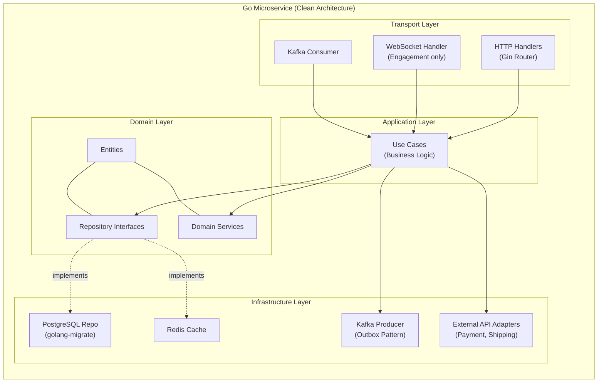
```mermaid
graph LR
    subgraph SERVICE["Go Microservice (Clean Architecture)"]
        direction TB

        subgraph TRANSPORT["Transport Layer"]
            HTTP_H["HTTP Handlers<br/>(Gin Router)"]
            WS_H["WebSocket Handler<br/>(Engagement only)"]
            KAFKA_C["Kafka Consumer"]
        end

        subgraph APP["Application Layer"]
            UC["Use Cases<br/>(Business Logic)"]
        end

        subgraph DOMAIN["Domain Layer"]
            ENT["Entities"]
            REPO_I["Repository Interfaces"]
            DOM_SVC["Domain Services"]
        end

        subgraph INFRA["Infrastructure Layer"]
            PG_R["PostgreSQL Repo<br/>(golang-migrate)"]
            REDIS_R["Redis Cache"]
            KAFKA_P["Kafka Producer<br/>(Outbox Pattern)"]
            EXT_API["External API Adapters<br/>(Payment, Shipping)"]
        end
    end

    HTTP_H --> UC
    WS_H --> UC
    KAFKA_C --> UC
    UC --> REPO_I
    UC --> DOM_SVC
    REPO_I -.->|implements| PG_R
    REPO_I -.->|implements| REDIS_R
    UC --> KAFKA_P
    UC --> EXT_API
    ENT --- REPO_I
    ENT --- DOM_SVC
```

### 4.3 Order Lifecycle — Saga Pattern

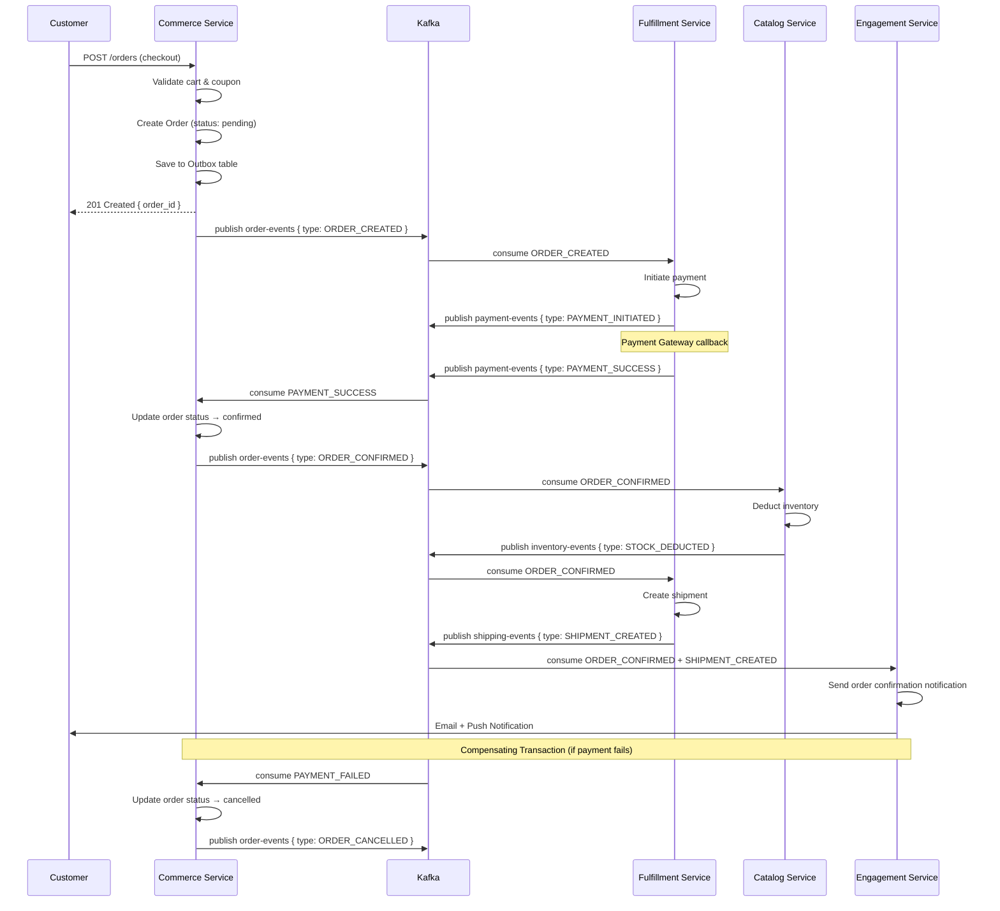
```mermaid
sequenceDiagram
    participant C as Customer
    participant CMS as Commerce Service
    participant K as Kafka
    participant FS as Fulfillment Service
    participant CAT as Catalog Service
    participant ES as Engagement Service

    C->>CMS: POST /orders (checkout)
    CMS->>CMS: Validate cart & coupon
    CMS->>CMS: Create Order (status: pending)
    CMS->>CMS: Save to Outbox table
    CMS-->>C: 201 Created { order_id }

    CMS->>K: publish order-events { type: ORDER_CREATED }

    K->>FS: consume ORDER_CREATED
    FS->>FS: Initiate payment
    FS->>K: publish payment-events { type: PAYMENT_INITIATED }

    Note over FS: Payment Gateway callback
    FS->>K: publish payment-events { type: PAYMENT_SUCCESS }

    K->>CMS: consume PAYMENT_SUCCESS
    CMS->>CMS: Update order status → confirmed
    CMS->>K: publish order-events { type: ORDER_CONFIRMED }

    K->>CAT: consume ORDER_CONFIRMED
    CAT->>CAT: Deduct inventory
    CAT->>K: publish inventory-events { type: STOCK_DEDUCTED }

    K->>FS: consume ORDER_CONFIRMED
    FS->>FS: Create shipment
    FS->>K: publish shipping-events { type: SHIPMENT_CREATED }

    K->>ES: consume ORDER_CONFIRMED + SHIPMENT_CREATED
    ES->>ES: Send order confirmation notification
    ES->>C: Email + Push Notification

    Note over CMS,ES: Compensating Transaction (if payment fails)
    K->>CMS: consume PAYMENT_FAILED
    CMS->>CMS: Update order status → cancelled
    CMS->>K: publish order-events { type: ORDER_CANCELLED }
```

---

## 5. Event Bus — Apache Kafka

### 5.1 Kafka Cluster Architecture

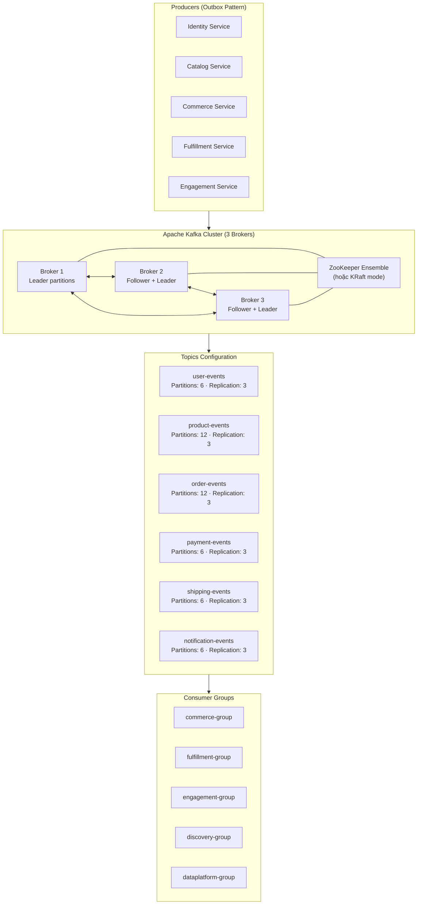
```mermaid
graph TB
    subgraph KAFKA_CLUSTER["Apache Kafka Cluster (3 Brokers)"]
        B1["Broker 1<br/>Leader partitions"]
        B2["Broker 2<br/>Follower + Leader"]
        B3["Broker 3<br/>Follower + Leader"]
        ZK["ZooKeeper Ensemble<br/>(hoặc KRaft mode)"]
        B1 <--> B2
        B2 <--> B3
        B1 <--> B3
        B1 & B2 & B3 --- ZK
    end

    subgraph TOPICS["Topics Configuration"]
        T1["user-events<br/>Partitions: 6 · Replication: 3"]
        T2["product-events<br/>Partitions: 12 · Replication: 3"]
        T3["order-events<br/>Partitions: 12 · Replication: 3"]
        T4["payment-events<br/>Partitions: 6 · Replication: 3"]
        T5["shipping-events<br/>Partitions: 6 · Replication: 3"]
        T6["notification-events<br/>Partitions: 6 · Replication: 3"]
    end

    subgraph PRODUCERS["Producers (Outbox Pattern)"]
        P1["Identity Service"]
        P2["Catalog Service"]
        P3["Commerce Service"]
        P4["Fulfillment Service"]
        P5["Engagement Service"]
    end

    subgraph CONSUMERS["Consumer Groups"]
        CG1["commerce-group"]
        CG2["fulfillment-group"]
        CG3["engagement-group"]
        CG4["discovery-group"]
        CG5["dataplatform-group"]
    end

    PRODUCERS --> KAFKA_CLUSTER
    KAFKA_CLUSTER --> TOPICS
    TOPICS --> CONSUMERS
```

### 5.2 Outbox Pattern — Đảm bảo At-Least-Once Delivery

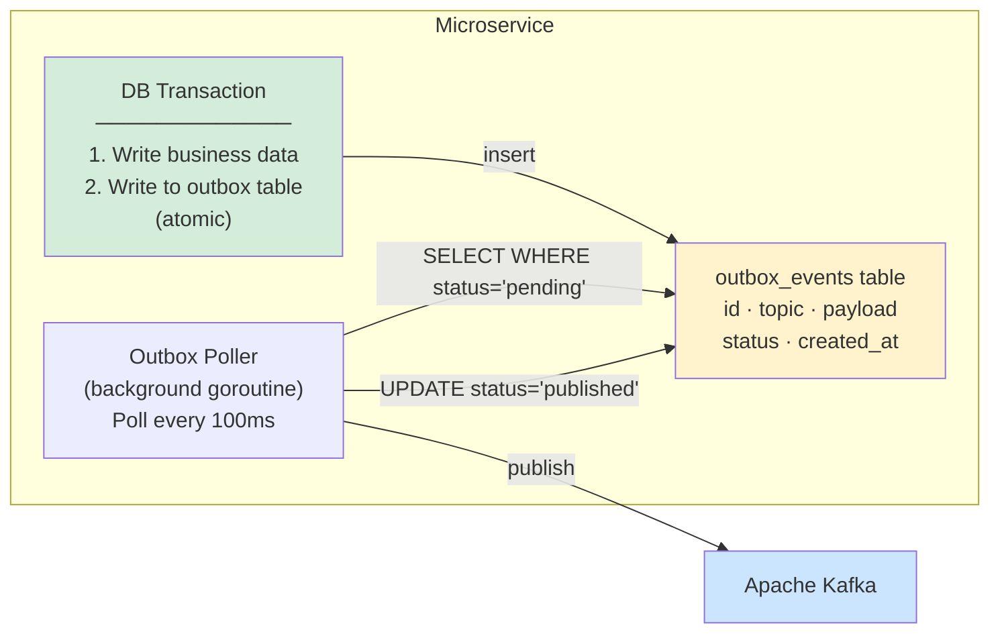
```mermaid
graph LR
    subgraph SERVICE["Microservice"]
        DB_TXN["DB Transaction<br/>─────────────<br/>1. Write business data<br/>2. Write to outbox table<br/>(atomic)"]
        POLLER["Outbox Poller<br/>(background goroutine)<br/>Poll every 100ms"]
        OUTBOX_TBL["outbox_events table<br/>id · topic · payload<br/>status · created_at"]
    end

    KAFKA["Apache Kafka"]

    DB_TXN -->|"insert"| OUTBOX_TBL
    POLLER -->|"SELECT WHERE status='pending'"| OUTBOX_TBL
    POLLER -->|"publish"| KAFKA
    POLLER -->|"UPDATE status='published'"| OUTBOX_TBL

    style DB_TXN fill:#d4edda
    style OUTBOX_TBL fill:#fff3cd
    style KAFKA fill:#cce5ff
```

---

## 6. Data Platform Layer

### 6.1 Data Pipeline Architecture

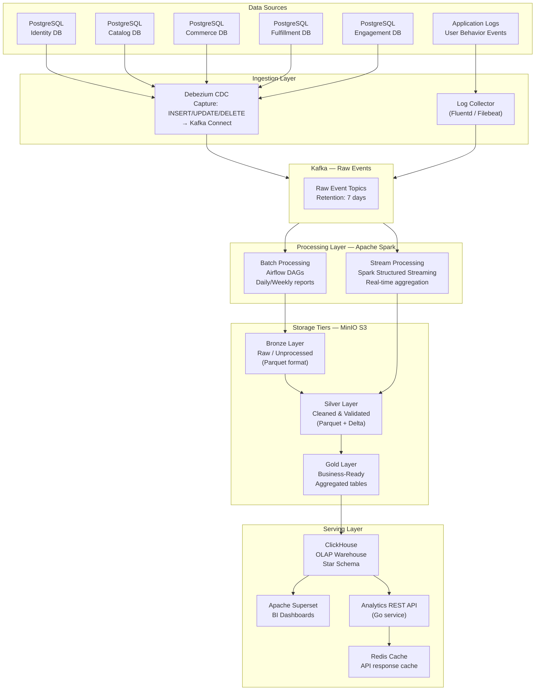
```mermaid
graph TB
    subgraph SOURCES["Data Sources"]
        PG1["PostgreSQL<br/>Identity DB"]
        PG2["PostgreSQL<br/>Catalog DB"]
        PG3["PostgreSQL<br/>Commerce DB"]
        PG4["PostgreSQL<br/>Fulfillment DB"]
        PG5["PostgreSQL<br/>Engagement DB"]
        LOGS["Application Logs<br/>User Behavior Events"]
    end

    subgraph INGESTION["Ingestion Layer"]
        DEB["Debezium CDC<br/>Capture: INSERT/UPDATE/DELETE<br/>→ Kafka Connect"]
        LOG_COL["Log Collector<br/>(Fluentd / Filebeat)"]
    end

    subgraph KAFKA_RAW["Kafka — Raw Events"]
        RAW["Raw Event Topics<br/>Retention: 7 days"]
    end

    subgraph PROCESSING["Processing Layer — Apache Spark"]
        BATCH["Batch Processing<br/>Airflow DAGs<br/>Daily/Weekly reports"]
        STREAM["Stream Processing<br/>Spark Structured Streaming<br/>Real-time aggregation"]
    end

    subgraph STORAGE["Storage Tiers — MinIO S3"]
        BRONZE["Bronze Layer<br/>Raw / Unprocessed<br/>(Parquet format)"]
        SILVER["Silver Layer<br/>Cleaned & Validated<br/>(Parquet + Delta)"]
        GOLD["Gold Layer<br/>Business-Ready<br/>Aggregated tables"]
    end

    subgraph SERVING["Serving Layer"]
        CH["ClickHouse<br/>OLAP Warehouse<br/>Star Schema"]
        CACHE_API["Redis Cache<br/>API response cache"]
        SUP["Apache Superset<br/>BI Dashboards"]
        ANAL_API["Analytics REST API<br/>(Go service)"]
    end

    PG1 & PG2 & PG3 & PG4 & PG5 --> DEB
    LOGS --> LOG_COL
    DEB --> KAFKA_RAW
    LOG_COL --> KAFKA_RAW
    KAFKA_RAW --> BATCH
    KAFKA_RAW --> STREAM
    BATCH --> BRONZE --> SILVER --> GOLD
    STREAM --> SILVER
    GOLD --> CH
    CH --> SUP
    CH --> ANAL_API
    ANAL_API --> CACHE_API
```

### 6.2 ClickHouse Star Schema

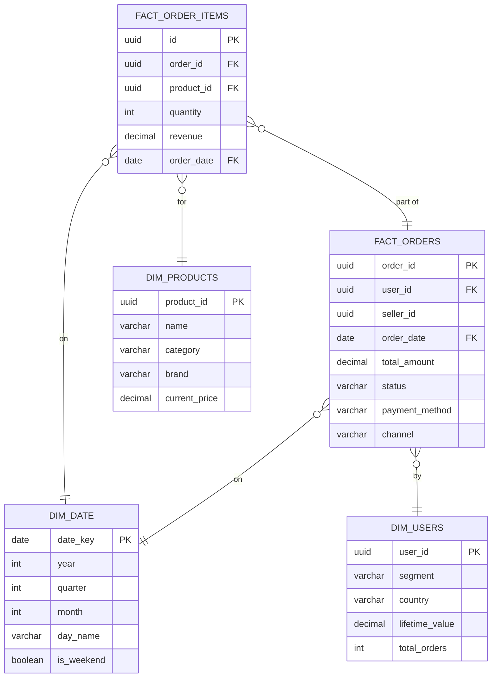
```mermaid
erDiagram
    FACT_ORDERS {
        uuid    order_id        PK
        uuid    user_id         FK
        uuid    seller_id
        date    order_date      FK
        decimal total_amount
        varchar status
        varchar payment_method
        varchar channel
    }

    FACT_ORDER_ITEMS {
        uuid    id              PK
        uuid    order_id        FK
        uuid    product_id      FK
        int     quantity
        decimal revenue
        date    order_date      FK
    }

    DIM_DATE {
        date    date_key        PK
        int     year
        int     quarter
        int     month
        varchar day_name
        boolean is_weekend
    }

    DIM_USERS {
        uuid    user_id         PK
        varchar segment
        varchar country
        decimal lifetime_value
        int     total_orders
    }

    DIM_PRODUCTS {
        uuid    product_id      PK
        varchar name
        varchar category
        varchar brand
        decimal current_price
    }

    FACT_ORDERS     }o--|| DIM_DATE      : "on"
    FACT_ORDERS     }o--|| DIM_USERS     : "by"
    FACT_ORDER_ITEMS }o--|| FACT_ORDERS  : "part of"
    FACT_ORDER_ITEMS }o--|| DIM_PRODUCTS : "for"
    FACT_ORDER_ITEMS }o--|| DIM_DATE     : "on"
```

---

## 7. AI & Intelligence Layer

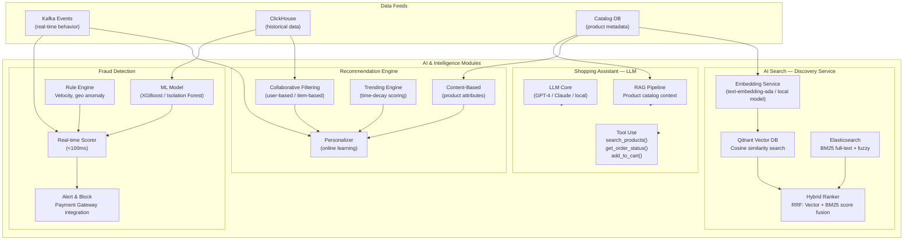
```mermaid
graph TB
    subgraph AI_LAYER["AI & Intelligence Modules"]

        subgraph SEARCH_AI["AI Search — Discovery Service"]
            EMBED["Embedding Service<br/>(text-embedding-ada / local model)"]
            QDRANT["Qdrant Vector DB<br/>Cosine similarity search"]
            ES_SRCH["Elasticsearch<br/>BM25 full-text + fuzzy"]
            HYBRID["Hybrid Ranker<br/>RRF: Vector + BM25 score fusion"]
        end

        subgraph RECSYS["Recommendation Engine"]
            CF["Collaborative Filtering<br/>(user-based / item-based)"]
            CB["Content-Based<br/>(product attributes)"]
            TREND["Trending Engine<br/>(time-decay scoring)"]
            PERS["Personalizer<br/>(online learning)"]
        end

        subgraph CHATBOT["Shopping Assistant — LLM"]
            LLM["LLM Core<br/>(GPT-4 / Claude / local)"]
            RAG["RAG Pipeline<br/>Product catalog context"]
            TOOL["Tool Use<br/>search_products()<br/>get_order_status()<br/>add_to_cart()"]
        end

        subgraph FRAUD["Fraud Detection"]
            RT_SCORE["Real-time Scorer<br/>(<100ms)"]
            ML_MDL["ML Model<br/>(XGBoost / Isolation Forest)"]
            RULES["Rule Engine<br/>Velocity, geo anomaly"]
            ALERT["Alert & Block<br/>Payment Gateway integration"]
        end
    end

    subgraph DATA_FEED["Data Feeds"]
        KAFKA_EVENTS["Kafka Events<br/>(real-time behavior)"]
        CLICKHOUSE["ClickHouse<br/>(historical data)"]
        PRODUCT_DB["Catalog DB<br/>(product metadata)"]
    end

    KAFKA_EVENTS --> PERS
    KAFKA_EVENTS --> RT_SCORE
    CLICKHOUSE --> CF
    CLICKHOUSE --> ML_MDL
    PRODUCT_DB --> EMBED
    PRODUCT_DB --> CB
    PRODUCT_DB --> RAG

    EMBED --> QDRANT
    ES_SRCH & QDRANT --> HYBRID
    CF & CB & TREND --> PERS
    ML_MDL & RULES --> RT_SCORE
    RT_SCORE --> ALERT
    LLM & RAG & TOOL --> CHATBOT
```

---

## 8. Infrastructure Layer — Kubernetes

### 8.1 Kubernetes Cluster Architecture

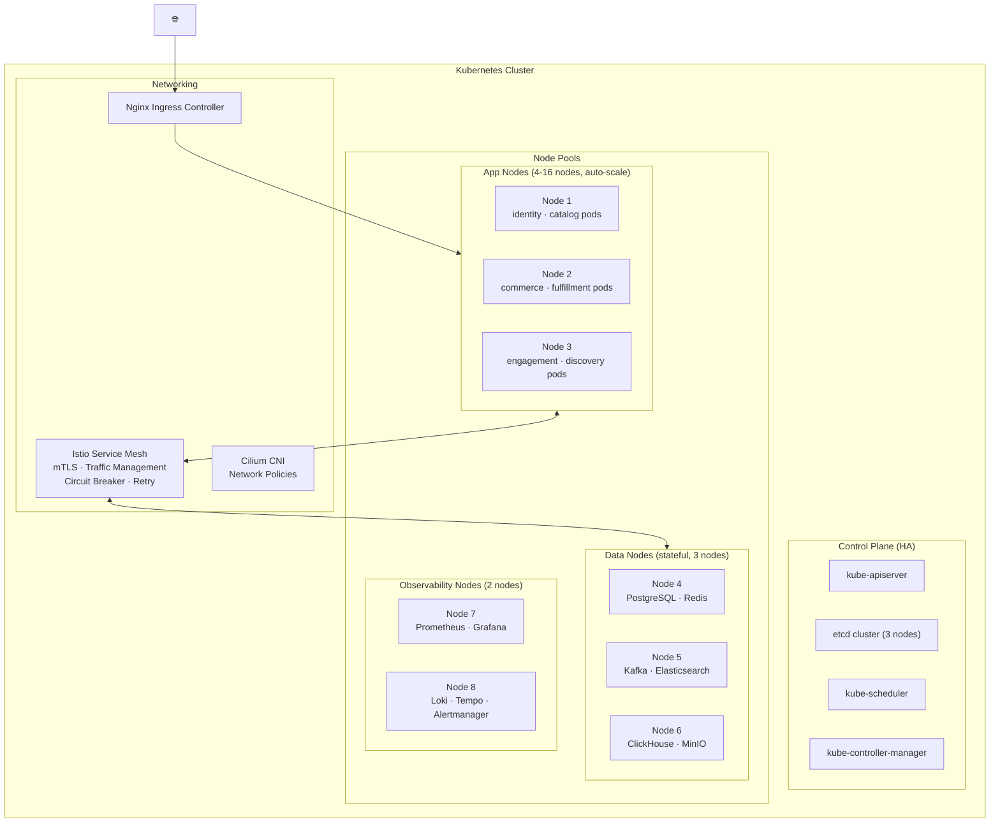
```mermaid
graph TB
    subgraph K8S["Kubernetes Cluster"]
        subgraph CP["Control Plane (HA)"]
            API_SRV["kube-apiserver"]
            ETCD["etcd cluster (3 nodes)"]
            SCHED["kube-scheduler"]
            CM["kube-controller-manager"]
        end

        subgraph NODE_POOLS["Node Pools"]
            subgraph APP_NODES["App Nodes (4-16 nodes, auto-scale)"]
                APP1["Node 1<br/>identity · catalog pods"]
                APP2["Node 2<br/>commerce · fulfillment pods"]
                APP3["Node 3<br/>engagement · discovery pods"]
            end

            subgraph DATA_NODES["Data Nodes (stateful, 3 nodes)"]
                DATA1["Node 4<br/>PostgreSQL · Redis"]
                DATA2["Node 5<br/>Kafka · Elasticsearch"]
                DATA3["Node 6<br/>ClickHouse · MinIO"]
            end

            subgraph OBS_NODES["Observability Nodes (2 nodes)"]
                OBS1["Node 7<br/>Prometheus · Grafana"]
                OBS2["Node 8<br/>Loki · Tempo · Alertmanager"]
            end
        end

        subgraph NETWORKING["Networking"]
            ISTIO["Istio Service Mesh<br/>mTLS · Traffic Management<br/>Circuit Breaker · Retry"]
            INGRESS["Nginx Ingress Controller"]
            CNI["Cilium CNI<br/>Network Policies"]
        end
    end

    INTERNET["🌐"] --> INGRESS
    INGRESS --> APP_NODES
    APP_NODES <--> ISTIO
    ISTIO <--> DATA_NODES
```

### 8.2 Service Deployment Spec — Mỗi Microservice

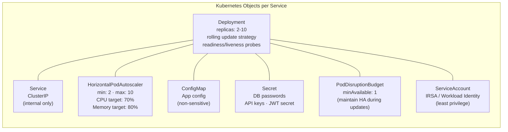
```mermaid
graph LR
    subgraph K8S_OBJECTS["Kubernetes Objects per Service"]
        DEP["Deployment<br/>replicas: 2-10<br/>rolling update strategy<br/>readiness/liveness probes"]
        SVC["Service<br/>ClusterIP<br/>(internal only)"]
        HPA["HorizontalPodAutoscaler<br/>min: 2 · max: 10<br/>CPU target: 70%<br/>Memory target: 80%"]
        CM_K["ConfigMap<br/>App config<br/>(non-sensitive)"]
        SEC["Secret<br/>DB passwords<br/>API keys · JWT secret"]
        PDB["PodDisruptionBudget<br/>minAvailable: 1<br/>(maintain HA during updates)"]
        SA["ServiceAccount<br/>IRSA / Workload Identity<br/>(least privilege)"]
    end

    DEP --- SVC
    DEP --- HPA
    DEP --- CM_K
    DEP --- SEC
    DEP --- PDB
    DEP --- SA
```

### 8.3 Helm Chart Structure

```
/helm-charts
  /novacommerce
    Chart.yaml
    values.yaml                  # default values
    values-staging.yaml          # staging overrides
    values-production.yaml       # production overrides
    /templates
      /identity-service
        deployment.yaml
        service.yaml
        hpa.yaml
        configmap.yaml
        secret.yaml
      /catalog-service
        ...
      /_helpers.tpl              # shared template helpers
      /NOTES.txt
```

---

## 9. Observability Stack

### 9.1 Three Pillars of Observability

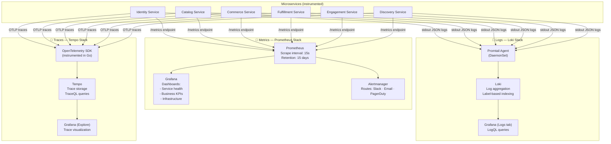
```mermaid
graph TB
    subgraph SERVICES_OBS["Microservices (instrumented)"]
        SVC1["Identity Service"]
        SVC2["Catalog Service"]
        SVC3["Commerce Service"]
        SVC4["Fulfillment Service"]
        SVC5["Engagement Service"]
        SVC6["Discovery Service"]
    end

    subgraph METRICS["📏 Metrics — Prometheus Stack"]
        PROM["Prometheus<br/>Scrape interval: 15s<br/>Retention: 15 days"]
        GRAF["Grafana<br/>Dashboards:<br/>- Service health<br/>- Business KPIs<br/>- Infrastructure"]
        ALERT["Alertmanager<br/>Routes: Slack · Email · PagerDuty"]
    end

    subgraph LOGS["📝 Logs — Loki Stack"]
        AGENT["Promtail Agent<br/>(DaemonSet)"]
        LOKI["Loki<br/>Log aggregation<br/>Label-based indexing"]
        GRAF_L["Grafana (Logs tab)<br/>LogQL queries"]
    end

    subgraph TRACES["🔗 Traces — Tempo Stack"]
        OTEL["OpenTelemetry SDK<br/>(instrumented in Go)"]
        TEMPO["Tempo<br/>Trace storage<br/>TraceQL queries"]
        GRAF_T["Grafana (Explore)<br/>Trace visualization"]
    end

    SVC1 & SVC2 & SVC3 & SVC4 & SVC5 & SVC6 -->|"/metrics endpoint"| PROM
    SVC1 & SVC2 & SVC3 & SVC4 & SVC5 & SVC6 -->|"stdout JSON logs"| AGENT
    SVC1 & SVC2 & SVC3 & SVC4 & SVC5 & SVC6 -->|"OTLP traces"| OTEL

    PROM --> GRAF
    PROM --> ALERT
    AGENT --> LOKI
    LOKI --> GRAF_L
    OTEL --> TEMPO
    TEMPO --> GRAF_T
```

### 9.2 Key Metrics & SLOs

| Service      | SLI               | SLO Target     | Alert Threshold                    |
| ------------ | ----------------- | -------------- | ---------------------------------- |
| All Services | API P99 Latency   | < 200ms        | > 500ms → Warning, > 1s → Critical |
| All Services | Error Rate (5xx)  | < 0.1%         | > 1% → Warning, > 5% → Critical    |
| All Services | Availability      | > 99.9%        | < 99.5% → Critical                 |
| Kafka        | Consumer Lag      | < 1000 msgs    | > 10000 → Warning                  |
| PostgreSQL   | Connection Pool   | < 80% utilized | > 90% → Warning                    |
| Redis        | Memory Usage      | < 80%          | > 90% → Warning                    |
| Kubernetes   | Pod Restart Count | 0 per hour     | > 3 restarts → Warning             |

---

## 10. CI/CD Pipeline


```mermaid
graph LR
    subgraph DEV["Developer"]
        CODE["💻 Code Change"]
        PR["Pull Request"]
    end

    subgraph CI["CI — GitHub Actions"]
        LINT["Lint & Format<br/>golangci-lint · gofmt"]
        TEST["Unit Tests<br/>go test -race<br/>Coverage > 80%"]
        INTEG["Integration Tests<br/>Testcontainers<br/>(real PostgreSQL, Redis)"]
        BUILD["Docker Build<br/>Multi-stage build<br/>Distroless base image"]
        SCAN["Security Scan<br/>Trivy (CVE scan)<br/>SAST: gosec"]
        PUSH["Push to Registry<br/>ghcr.io/novacommerce/<br/>Tagged: git-sha + semver"]
    end

    subgraph CD["CD — ArgoCD (GitOps)"]
        UPDATE["Update Helm values<br/>image.tag = new-sha"]
        ARGO["ArgoCD detects drift<br/>Auto-sync enabled"]
        DEPLOY_STG["Deploy → Staging<br/>Automated"]
        SMOKE["Smoke Tests<br/>k6 load test<br/>Canary health check"]
        PROMOTE["Promote to Production<br/>(manual approval gate)"]
        DEPLOY_PROD["Deploy → Production<br/>Rolling update<br/>maxSurge: 1, maxUnavailable: 0"]
    end

    CODE --> PR --> LINT --> TEST --> INTEG --> BUILD --> SCAN --> PUSH
    PUSH --> UPDATE --> ARGO --> DEPLOY_STG --> SMOKE --> PROMOTE --> DEPLOY_PROD
```

### Deployment Strategy

| Environment | Strategy                         | Rollback                     |
| ----------- | -------------------------------- | ---------------------------- |
| Staging     | Rolling Update (auto)            | ArgoCD sync to prev revision |
| Production  | Rolling Update (0 downtime)      | ArgoCD rollback < 2 min      |
| Hotfix      | Blue-Green (Istio traffic split) | Instant: 100% → old version  |

---

## 11. Request Flow — Luồng Xử lý Điển hình

### 11.1 Customer: Tìm kiếm & Đặt hàng

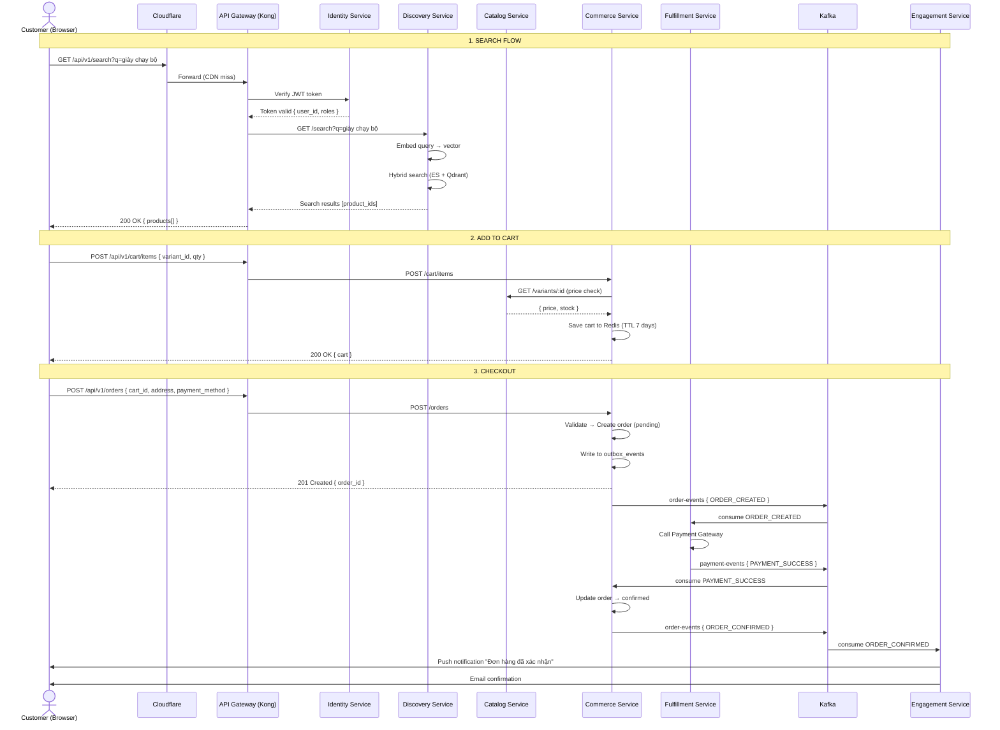
```mermaid
sequenceDiagram
    actor C as Customer (Browser)
    participant CF as Cloudflare
    participant GW as API Gateway (Kong)
    participant IS as Identity Service
    participant DS as Discovery Service
    participant CAT as Catalog Service
    participant CMS as Commerce Service
    participant FS as Fulfillment Service
    participant K as Kafka
    participant ES as Engagement Service

    Note over C,ES: 1. SEARCH FLOW
    C->>CF: GET /api/v1/search?q=giày chạy bộ
    CF->>GW: Forward (CDN miss)
    GW->>IS: Verify JWT token
    IS-->>GW: Token valid { user_id, roles }
    GW->>DS: GET /search?q=giày chạy bộ
    DS->>DS: Embed query → vector
    DS->>DS: Hybrid search (ES + Qdrant)
    DS-->>GW: Search results [product_ids]
    GW-->>C: 200 OK { products[] }

    Note over C,ES: 2. ADD TO CART
    C->>GW: POST /api/v1/cart/items { variant_id, qty }
    GW->>CMS: POST /cart/items
    CMS->>CAT: GET /variants/:id (price check)
    CAT-->>CMS: { price, stock }
    CMS->>CMS: Save cart to Redis (TTL 7 days)
    CMS-->>C: 200 OK { cart }

    Note over C,ES: 3. CHECKOUT
    C->>GW: POST /api/v1/orders { cart_id, address, payment_method }
    GW->>CMS: POST /orders
    CMS->>CMS: Validate → Create order (pending)
    CMS->>CMS: Write to outbox_events
    CMS-->>C: 201 Created { order_id }
    CMS->>K: order-events { ORDER_CREATED }

    K->>FS: consume ORDER_CREATED
    FS->>FS: Call Payment Gateway
    FS->>K: payment-events { PAYMENT_SUCCESS }

    K->>CMS: consume PAYMENT_SUCCESS
    CMS->>CMS: Update order → confirmed
    CMS->>K: order-events { ORDER_CONFIRMED }

    K->>ES: consume ORDER_CONFIRMED
    ES->>C: Push notification "Đơn hàng đã xác nhận"
    ES->>C: Email confirmation
```

### 11.2 Seller: Thêm sản phẩm mới

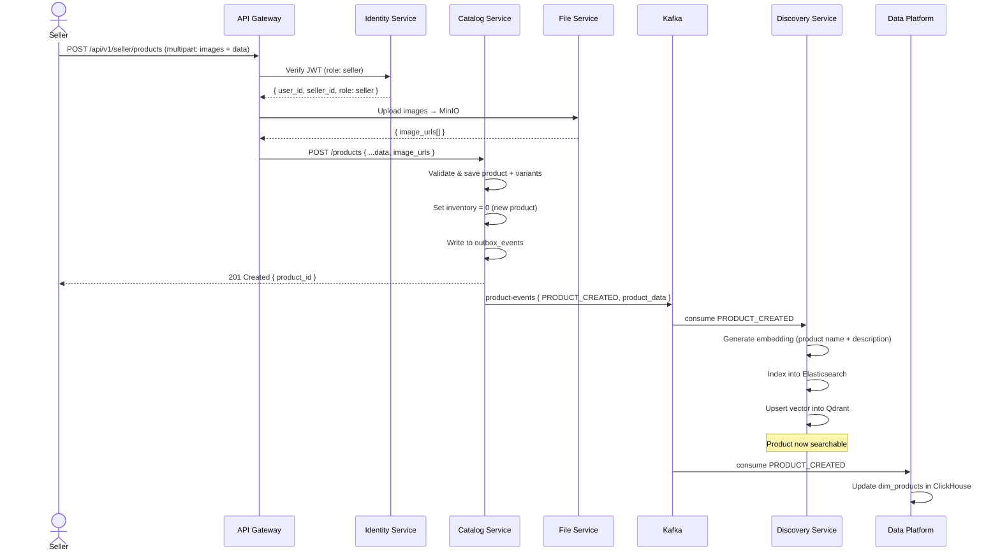
```mermaid
sequenceDiagram
    actor S as Seller
    participant GW as API Gateway
    participant IS as Identity Service
    participant CAT as Catalog Service
    participant FS_SVC as File Service
    participant K as Kafka
    participant DS as Discovery Service
    participant DP as Data Platform

    S->>GW: POST /api/v1/seller/products (multipart: images + data)
    GW->>IS: Verify JWT (role: seller)
    IS-->>GW: { user_id, seller_id, role: seller }

    GW->>FS_SVC: Upload images → MinIO
    FS_SVC-->>GW: { image_urls[] }

    GW->>CAT: POST /products { ...data, image_urls }
    CAT->>CAT: Validate & save product + variants
    CAT->>CAT: Set inventory = 0 (new product)
    CAT->>CAT: Write to outbox_events
    CAT-->>S: 201 Created { product_id }

    CAT->>K: product-events { PRODUCT_CREATED, product_data }

    K->>DS: consume PRODUCT_CREATED
    DS->>DS: Generate embedding (product name + description)
    DS->>DS: Index into Elasticsearch
    DS->>DS: Upsert vector into Qdrant
    Note over DS: Product now searchable

    K->>DP: consume PRODUCT_CREATED
    DP->>DP: Update dim_products in ClickHouse
```

---

## 12. Deployment Architecture

### 12.1 Multi-Environment Strategy

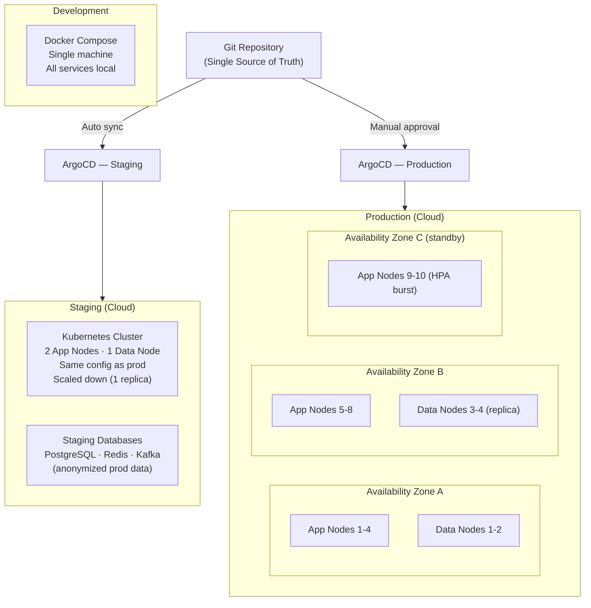
```mermaid
graph TB
    subgraph DEV_ENV["Development"]
        DC["Docker Compose<br/>Single machine<br/>All services local"]
    end

    subgraph STG_ENV["Staging (Cloud)"]
        STG_K8S["Kubernetes Cluster<br/>2 App Nodes · 1 Data Node<br/>Same config as prod<br/>Scaled down (1 replica)"]
        STG_DB["Staging Databases<br/>PostgreSQL · Redis · Kafka<br/>(anonymized prod data)"]
    end

    subgraph PROD_ENV["Production (Cloud)"]
        subgraph AZ_A["Availability Zone A"]
            PROD_APP1["App Nodes 1-4"]
            PROD_DATA1["Data Nodes 1-2"]
        end
        subgraph AZ_B["Availability Zone B"]
            PROD_APP2["App Nodes 5-8"]
            PROD_DATA2["Data Nodes 3-4 (replica)"]
        end
        subgraph AZ_C["Availability Zone C (standby)"]
            PROD_APP3["App Nodes 9-10 (HPA burst)"]
        end
    end

    GIT["Git Repository<br/>(Single Source of Truth)"]
    ARGO_STG["ArgoCD — Staging"]
    ARGO_PROD["ArgoCD — Production"]

    GIT -->|"Auto sync"| ARGO_STG --> STG_ENV
    GIT -->|"Manual approval"| ARGO_PROD --> PROD_ENV
```

### 12.2 Database High Availability

| Database      | HA Strategy                                       | Backup                     | RTO      | RPO     |
| ------------- | ------------------------------------------------- | -------------------------- | -------- | ------- |
| PostgreSQL    | Primary + 2 Read Replicas (streaming replication) | Daily full + WAL archiving | < 5 min  | < 1 min |
| Redis         | Redis Sentinel (1 primary + 2 replica)            | RDB snapshots hourly       | < 30s    | < 60s   |
| Kafka         | 3 brokers, replication factor 3, min ISR 2        | Topic backup to MinIO      | < 1 min  | ~0      |
| Elasticsearch | 3-node cluster, 1 primary + 1 replica shard       | Snapshots to MinIO daily   | < 10 min | < 24h   |
| ClickHouse    | 2 shards × 2 replicas                             | Daily snapshots            | < 15 min | < 24h   |

---

## 13. Security Architecture

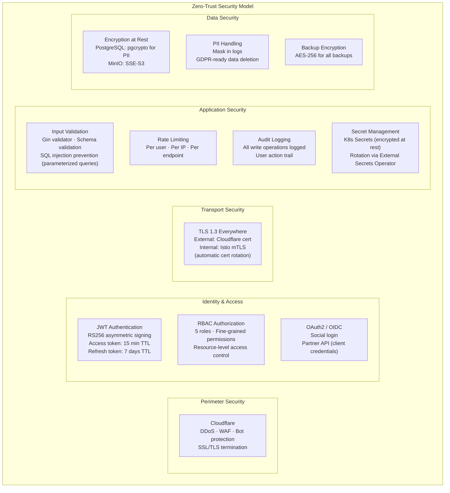
```mermaid
graph TB
    subgraph ZERO_TRUST["Zero-Trust Security Model"]

        subgraph PERIMETER["Perimeter Security"]
            CF_SEC["Cloudflare<br/>DDoS · WAF · Bot protection<br/>SSL/TLS termination"]
        end

        subgraph IDENTITY_SEC["Identity & Access"]
            JWT_AUTH["JWT Authentication<br/>RS256 asymmetric signing<br/>Access token: 15 min TTL<br/>Refresh token: 7 days TTL"]
            RBAC_SEC["RBAC Authorization<br/>5 roles · Fine-grained permissions<br/>Resource-level access control"]
            OAUTH2_SEC["OAuth2 / OIDC<br/>Social login<br/>Partner API (client credentials)"]
        end

        subgraph TRANSPORT_SEC["Transport Security"]
            TLS["TLS 1.3 Everywhere<br/>External: Cloudflare cert<br/>Internal: Istio mTLS<br/>(automatic cert rotation)"]
        end

        subgraph APP_SEC["Application Security"]
            INPUT["Input Validation<br/>Gin validator · Schema validation<br/>SQL injection prevention (parameterized queries)"]
            RATE_L["Rate Limiting<br/>Per user · Per IP · Per endpoint"]
            AUDIT["Audit Logging<br/>All write operations logged<br/>User action trail"]
            SECRETS["Secret Management<br/>K8s Secrets (encrypted at rest)<br/>Rotation via External Secrets Operator"]
        end

        subgraph DATA_SEC["Data Security"]
            ENC_REST["Encryption at Rest<br/>PostgreSQL: pgcrypto for PII<br/>MinIO: SSE-S3"]
            PII["PII Handling<br/>Mask in logs<br/>GDPR-ready data deletion"]
            BACKUP_ENC["Backup Encryption<br/>AES-256 for all backups"]
        end
    end
```

---

## 14. Scaling Strategy

### 14.1 Horizontal Scaling per Component

```mermaid
graph LR
    subgraph TRIGGERS["Scale Triggers"]
        CPU["CPU > 70%"]
        MEM["Memory > 80%"]
        RPS["RPS per pod > threshold"]
        LAG["Kafka consumer lag > 10000"]
    end

    subgraph SCALE_ACTIONS["Auto-scaling Actions"]
        SVC_SCALE["Service Pods<br/>HPA: 2 → 10 replicas<br/>Scale-up: 30s<br/>Scale-down: 5 min (cooldown)"]
        DB_SCALE["DB Read Replicas<br/>Add read replica for read-heavy<br/>Services route reads → replicas"]
        KAFKA_SCALE["Kafka Partitions<br/>Pre-provisioned partitions = max consumers<br/>Add consumers to group (linear scale)"]
        ES_SCALE["Elasticsearch Nodes<br/>Add data nodes → rebalance shards<br/>Increase replicas for read throughput"]
    end

    CPU & MEM & RPS --> SVC_SCALE
    RPS --> DB_SCALE
    LAG --> KAFKA_SCALE
    RPS --> ES_SCALE
```

### 14.2 Capacity Estimation

| Component        | Current Target | Peak (10x)       | Scale Mechanism                |
| ---------------- | -------------- | ---------------- | ------------------------------ |
| API Requests     | 1,000 RPS      | 10,000 RPS       | HPA pods + CDN cache           |
| Order Processing | 500 orders/min | 5,000 orders/min | Commerce + Fulfillment HPA     |
| Product Catalog  | 10M products   | 100M products    | Elasticsearch sharding         |
| Kafka Throughput | 50K msgs/sec   | 500K msgs/sec    | Add partitions + brokers       |
| Data Pipeline    | 10GB/day       | 100GB/day        | Spark executor scaling         |
| Search Queries   | 2,000 QPS      | 20,000 QPS       | Elasticsearch replicas + cache |

---

## Tài liệu Liên quan

| Tài liệu                      | Mô tả                                           |
| ----------------------------- | ----------------------------------------------- |
| `ERD.md`                      | Entity Relationship Diagram cho tất cả services |
| `PROJECT_CONTEXT.md`          | Ngữ cảnh dự án đầy đủ cho Cursor AI Agent       |
| `/docs/api-specs/`            | OpenAPI 3.0 specs cho từng service              |
| `/infrastructure/kubernetes/` | Helm charts & K8s manifests                     |
| `/data-platform/`             | Spark jobs, Airflow DAGs, ClickHouse schemas    |

---

_NovaCommerce — Build for the future_  
_Enterprise Commerce & Intelligence Platform | Build. Sell. Analyze. Scale._
