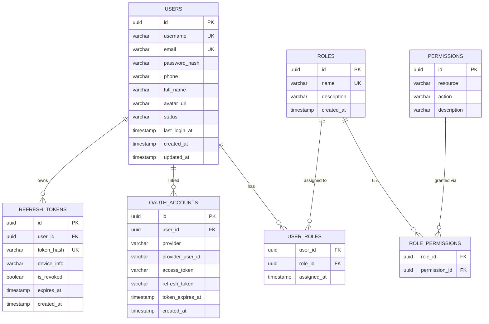
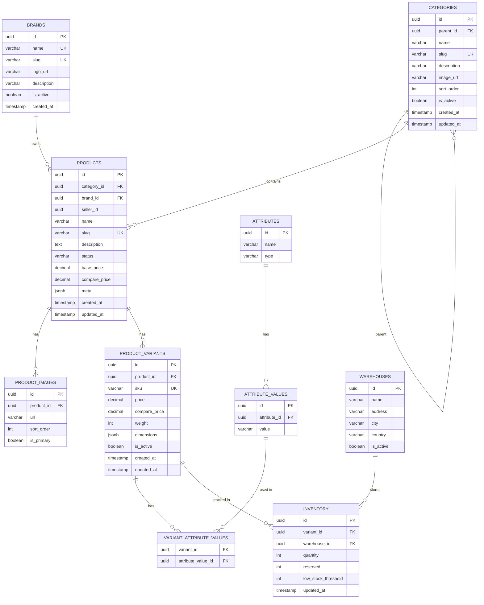
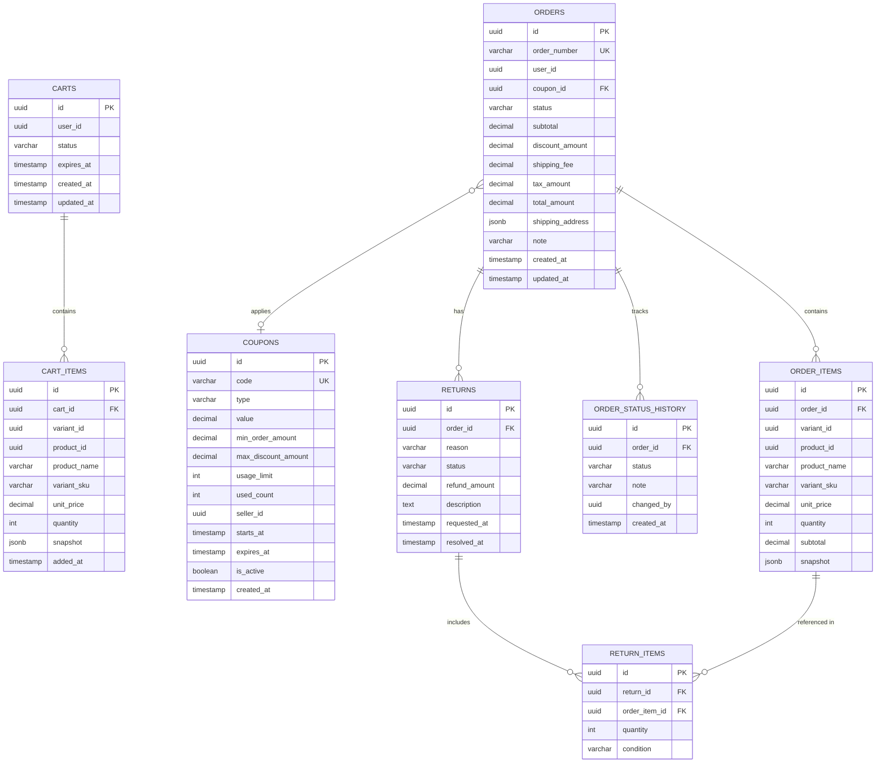
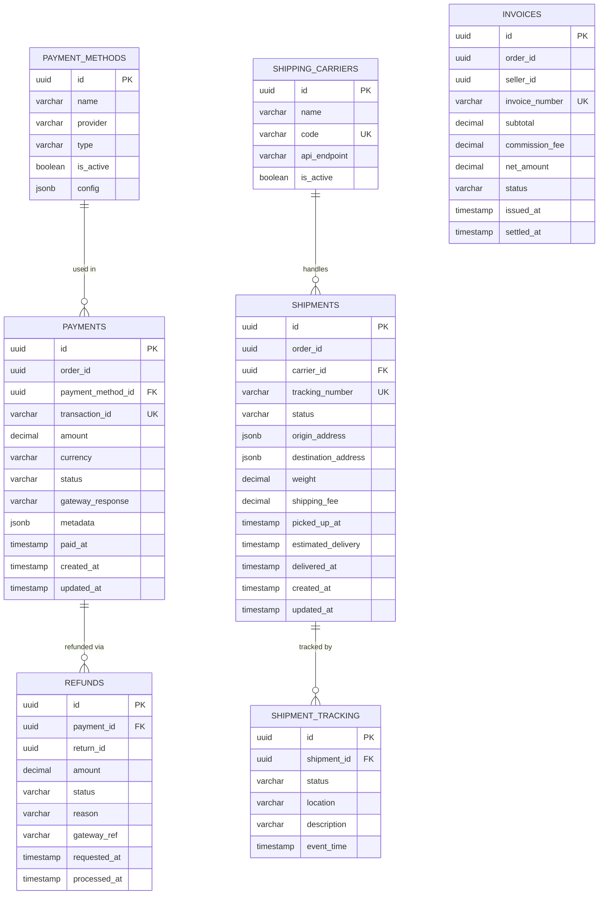
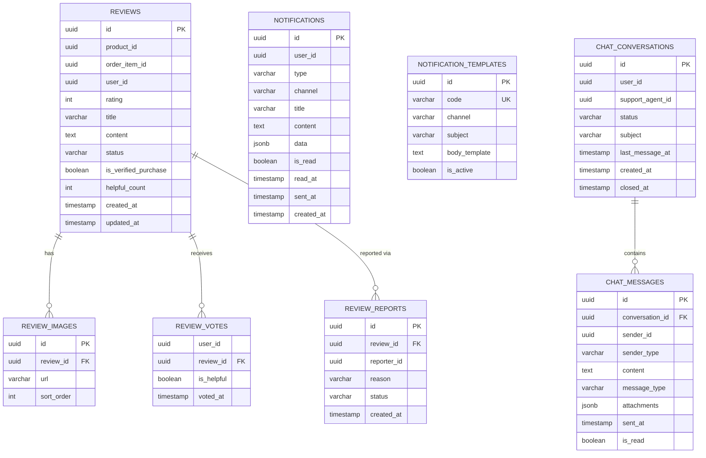
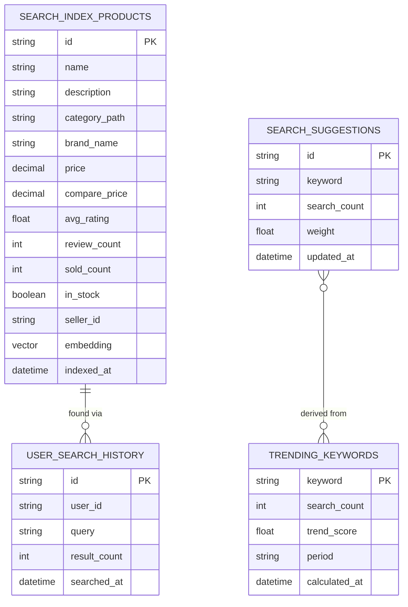
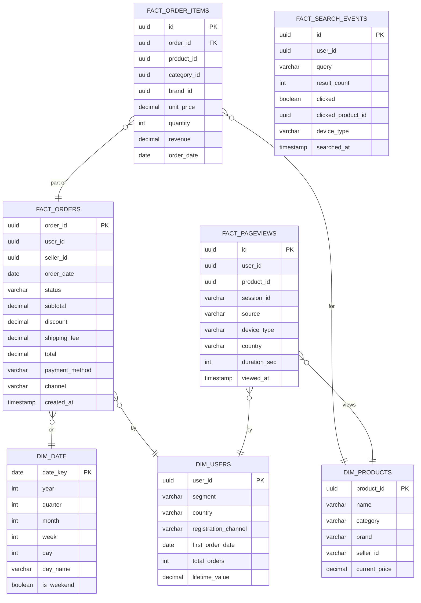
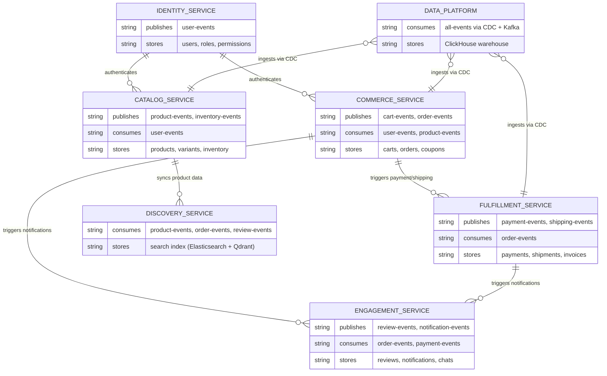

# NovaCommerce - Entity Relationship Diagram

> **Kiến trúc:** Microservices — mỗi service có schema database riêng biệt.  
> Các service giao tiếp với nhau qua **Apache Kafka** (event-driven), không join trực tiếp qua DB.

---

## 1. Identity Service (PostgreSQL)

---

## 2. Catalog Service (PostgreSQL + Redis)

---

## 3. Commerce Service (PostgreSQL + Redis)

---

## 4. Fulfillment Service (PostgreSQL)

---

## 5. Engagement Service (PostgreSQL + Redis + Kafka)

---

## 6. Discovery Service (Elasticsearch + Qdrant)

> Discovery Service chủ yếu dùng **Elasticsearch** (full-text search) và **Qdrant** (vector search).  
> Dữ liệu được đồng bộ từ Catalog Service qua Kafka — không lưu trữ trong PostgreSQL riêng.

---

## 7. Data Platform (ClickHouse — Analytics Warehouse)

---

## 8. Tổng quan Luồng Dữ liệu Giữa Các Service

---

## Ghi chú Thiết kế

| Nguyên tắc | Chi tiết |
|---|---|
| **Database per Service** | Mỗi microservice có schema PostgreSQL/Redis riêng, không share database |
| **Event-Driven Communication** | Các service không gọi DB của nhau; giao tiếp qua Kafka topics |
| **CQRS Pattern** | Discovery Service dùng Elasticsearch/Qdrant riêng cho read — tối ưu query |
| **Polyglot Persistence** | PostgreSQL (OLTP), Redis (cache/session), Elasticsearch (search), Qdrant (vector), ClickHouse (OLAP) |
| **Soft Delete** | Các entity quan trọng (users, products, orders) dùng `status` thay vì xóa cứng |
| **Audit Trail** | Order status history, shipment tracking lưu toàn bộ lịch sử thay đổi |
| **Data Snapshot** | `ORDER_ITEMS.snapshot` lưu thông tin sản phẩm tại thời điểm đặt hàng — tránh mất dữ liệu khi product thay đổi |
