# NovaCommerce Database Design

> **Version:** 1.0.0  
> **Status:** Implemented — synchronized with `packages/database/prisma/schema.prisma`  
> **Last Updated:** 2026-09-09

---

## 1. Purpose

PostgreSQL transactional database for NovaCommerce Modular Monolith.

Goals:

- One PostgreSQL database with **logical module ownership**
- Bounded Context isolation — no cross-module business table access
- Outbox Pattern for reliable domain event publishing
- Extractable to Event-Driven Microservices without schema rewrites

---

## 2. Database Architecture

```text
PostgreSQL (single database)
│
├── Identity          identities, credentials, external_identities, refresh_sessions
├── User              users, user_profiles, user_addresses, user_preferences
├── Catalog           categories, products, product_variants, product_images,
│                     product_attributes, product_options
├── Cart              carts, cart_items
├── Checkout          checkout_sessions, checkout_lines, checkout_adjustments
├── Order             orders, order_lines, order_adjustments, order_addresses,
│                     order_payment_references, order_shipment_references
├── Inventory         inventory_items, stock_reservations, stock_adjustments
├── Payment           payments, payment_attempts, payment_transactions
├── Shipping          shipments, shipment_items, tracking_records
├── Promotion         promotions, promotion_rules, promotion_benefits,
│                     coupons, coupon_redemptions
├── Notification      notifications, notification_deliveries
├── Review            reviews, review_media
├── CMS               contents, content_revisions
└── Outbox            outbox_messages
```

**Not in PostgreSQL (by design):**

| Concern | Technology |
|---------|------------|
| Search | OpenSearch |
| Analytics | Read models / projections |
| Binary assets | MinIO |

---

## 3. Logical Domain Separation

Each module owns its tables. Application code must not query another module's tables directly.

Cross-context references use **UUID columns only** — no Prisma `@relation` across modules.

| Module | Owned Tables |
|--------|--------------|
| Identity | `identities`, `credentials`, `external_identities`, `refresh_sessions` |
| User | `users`, `user_profiles`, `user_addresses`, `user_preferences` |
| Catalog | `categories`, `products`, `product_variants`, `product_images`, `product_attributes`, `product_options` |
| Cart | `carts`, `cart_items` |
| Checkout | `checkout_sessions`, `checkout_lines`, `checkout_adjustments` |
| Order | `orders`, `order_lines`, `order_adjustments`, `order_addresses`, `order_payment_references`, `order_shipment_references` |
| Inventory | `inventory_items`, `stock_reservations`, `stock_adjustments` |
| Payment | `payments`, `payment_attempts`, `payment_transactions` |
| Shipping | `shipments`, `shipment_items`, `tracking_records` |
| Promotion | `promotions`, `promotion_rules`, `promotion_benefits`, `coupons`, `coupon_redemptions` |
| Notification | `notifications`, `notification_deliveries` |
| Review | `reviews`, `review_media` |
| CMS | `contents`, `content_revisions` |
| Outbox | `outbox_messages` |

---

## 4. Identifier Strategy

- All primary keys: **UUID** (`@db.Uuid`)
- Default generation: application layer (explicit IDs in domain)
- Prisma `@default(uuid())` available for infrastructure inserts
- Cross-module references store UUID only (e.g. `customer_id`, `order_id`, `product_id`)

---

## 5. Timestamp Conventions

All business tables include:

| Field | Column | Notes |
|-------|--------|-------|
| `createdAt` | `created_at` | `@default(now())` |
| `updatedAt` | `updated_at` | `@updatedAt` |

`content_revisions` stores `created_at` only (immutable revision snapshot).

---

## 6. Naming Conventions

| Layer | Convention |
|-------|------------|
| Prisma models | PascalCase |
| Prisma fields | camelCase |
| PostgreSQL tables | snake_case plural (`@@map`) |
| PostgreSQL columns | snake_case (`@map`) |

---

## 7. Enums

| Prisma Enum | Values |
|-------------|--------|
| `ProductStatus` | `draft`, `published`, `archived` |
| `CheckoutStatus` | `started`, `completed`, `abandoned` |
| `CheckoutAdjustmentType` | `discount`, `shipping`, `tax` |
| `OrderStatus` | `pending`, `confirmed`, `cancelled`, `completed` |
| `ReservationStatus` | `active`, `released`, `fulfilled` |
| `PaymentStatus` | `initiated`, `succeeded`, `failed`, `refunded` |
| `PaymentAttemptStatus` | `pending`, `succeeded`, `failed` |
| `ShipmentStatus` | `created`, `dispatched`, `in_transit`, `delivered` |
| `DeliveryStatus` | `pending`, `sent`, `failed` |
| `ReviewStatus` | `draft`, `published` |
| `ContentStatus` | `draft`, `published`, `archived` |

---

## 8. Entities

### 8.1 Identity

#### `identities`

| Column | Type | Constraints |
|--------|------|-------------|
| `id` | UUID | PK |
| `email` | TEXT | NOT NULL, UNIQUE |
| `disabled` | BOOLEAN | NOT NULL, DEFAULT false |
| `created_at` | TIMESTAMP(3) | NOT NULL |
| `updated_at` | TIMESTAMP(3) | NOT NULL |

#### `credentials`

| Column | Type | Constraints |
|--------|------|-------------|
| `id` | UUID | PK |
| `identity_id` | UUID | FK → `identities.id` CASCADE |
| `password_hash` | TEXT | NOT NULL |
| `algorithm` | TEXT | NOT NULL |
| `created_at` | TIMESTAMP(3) | NOT NULL |
| `updated_at` | TIMESTAMP(3) | NOT NULL |

#### `external_identities`

| Column | Type | Constraints |
|--------|------|-------------|
| `id` | UUID | PK |
| `identity_id` | UUID | FK → `identities.id` CASCADE |
| `provider_name` | TEXT | NOT NULL |
| `provider_external_id` | TEXT | NULL |
| `created_at` | TIMESTAMP(3) | NOT NULL |
| `updated_at` | TIMESTAMP(3) | NOT NULL |

Unique: `(provider_name, provider_external_id)`

#### `refresh_sessions`

| Column | Type | Constraints |
|--------|------|-------------|
| `id` | UUID | PK |
| `identity_id` | UUID | FK → `identities.id` CASCADE |
| `token_hash` | TEXT | NOT NULL |
| `expires_at` | TIMESTAMP(3) | NOT NULL |
| `revoked` | BOOLEAN | NOT NULL, DEFAULT false |
| `created_at` | TIMESTAMP(3) | NOT NULL |
| `updated_at` | TIMESTAMP(3) | NOT NULL |

---

### 8.2 User

#### `users`

| Column | Type | Constraints |
|--------|------|-------------|
| `id` | UUID | PK |
| `identity_id` | UUID | NOT NULL, UNIQUE (logical ref → Identity) |
| `created_at` | TIMESTAMP(3) | NOT NULL |
| `updated_at` | TIMESTAMP(3) | NOT NULL |

#### `user_profiles`

| Column | Type | Constraints |
|--------|------|-------------|
| `id` | UUID | PK |
| `user_id` | UUID | FK → `users.id` CASCADE, UNIQUE |
| `display_name` | TEXT | NOT NULL |
| `phone_number` | TEXT | NULL |
| `avatar_url` | TEXT | NULL |
| `created_at` | TIMESTAMP(3) | NOT NULL |
| `updated_at` | TIMESTAMP(3) | NOT NULL |

#### `user_addresses`

| Column | Type | Constraints |
|--------|------|-------------|
| `id` | UUID | PK |
| `user_id` | UUID | FK → `users.id` CASCADE |
| `label` | TEXT | NOT NULL |
| `line1` | TEXT | NOT NULL |
| `line2` | TEXT | NULL |
| `city` | TEXT | NOT NULL |
| `state` | TEXT | NOT NULL |
| `postal_code` | TEXT | NOT NULL |
| `country` | TEXT | NOT NULL |
| `is_default` | BOOLEAN | NOT NULL, DEFAULT false |
| `created_at` | TIMESTAMP(3) | NOT NULL |
| `updated_at` | TIMESTAMP(3) | NOT NULL |

#### `user_preferences`

| Column | Type | Constraints |
|--------|------|-------------|
| `id` | UUID | PK |
| `user_id` | UUID | FK → `users.id` CASCADE |
| `key` | TEXT | NOT NULL |
| `value` | TEXT | NOT NULL |
| `created_at` | TIMESTAMP(3) | NOT NULL |
| `updated_at` | TIMESTAMP(3) | NOT NULL |

Unique: `(user_id, key)`

---

### 8.3 Catalog

#### `categories`

| Column | Type | Constraints |
|--------|------|-------------|
| `id` | UUID | PK |
| `name` | TEXT | NOT NULL |
| `slug` | TEXT | NOT NULL, UNIQUE |
| `parent_id` | UUID | FK → `categories.id` SET NULL |
| `created_at` | TIMESTAMP(3) | NOT NULL |
| `updated_at` | TIMESTAMP(3) | NOT NULL |

#### `products`

| Column | Type | Constraints |
|--------|------|-------------|
| `id` | UUID | PK |
| `name` | TEXT | NOT NULL |
| `slug` | TEXT | NOT NULL, UNIQUE |
| `base_price_amount` | DECIMAL(19,4) | NOT NULL |
| `base_price_currency` | CHAR(3) | NOT NULL |
| `status` | ProductStatus | NOT NULL, DEFAULT draft |
| `category_id` | UUID | FK → `categories.id` SET NULL |
| `created_at` | TIMESTAMP(3) | NOT NULL |
| `updated_at` | TIMESTAMP(3) | NOT NULL |

#### `product_variants`

| Column | Type | Constraints |
|--------|------|-------------|
| `id` | UUID | PK |
| `product_id` | UUID | FK → `products.id` CASCADE |
| `sku` | TEXT | NOT NULL, UNIQUE |
| `price_amount` | DECIMAL(19,4) | NOT NULL |
| `price_currency` | CHAR(3) | NOT NULL |
| `attributes` | JSONB | NOT NULL |
| `created_at` | TIMESTAMP(3) | NOT NULL |
| `updated_at` | TIMESTAMP(3) | NOT NULL |

#### `product_images`

| Column | Type | Constraints |
|--------|------|-------------|
| `id` | UUID | PK |
| `product_id` | UUID | FK → `products.id` CASCADE |
| `url` | TEXT | NOT NULL |
| `sort_order` | INTEGER | NOT NULL |
| `created_at` | TIMESTAMP(3) | NOT NULL |
| `updated_at` | TIMESTAMP(3) | NOT NULL |

#### `product_attributes`

| Column | Type | Constraints |
|--------|------|-------------|
| `id` | UUID | PK |
| `product_id` | UUID | FK → `products.id` CASCADE |
| `name` | TEXT | NOT NULL |
| `value` | TEXT | NOT NULL |
| `created_at` | TIMESTAMP(3) | NOT NULL |
| `updated_at` | TIMESTAMP(3) | NOT NULL |

#### `product_options`

| Column | Type | Constraints |
|--------|------|-------------|
| `id` | UUID | PK |
| `product_id` | UUID | FK → `products.id` CASCADE |
| `name` | TEXT | NOT NULL |
| `values` | JSONB | NOT NULL |
| `created_at` | TIMESTAMP(3) | NOT NULL |
| `updated_at` | TIMESTAMP(3) | NOT NULL |

> `product_options` maps to Catalog `ProductOption` entity (domain-model.md).

---

### 8.4 Cart

#### `carts`

| Column | Type | Constraints |
|--------|------|-------------|
| `id` | UUID | PK |
| `customer_id` | UUID | NULL (logical ref → User) |
| `created_at` | TIMESTAMP(3) | NOT NULL |
| `updated_at` | TIMESTAMP(3) | NOT NULL |

#### `cart_items`

| Column | Type | Constraints |
|--------|------|-------------|
| `id` | UUID | PK |
| `cart_id` | UUID | FK → `carts.id` CASCADE |
| `product_id` | UUID | NOT NULL (logical ref → Catalog) |
| `variant_id` | UUID | NULL (logical ref → Catalog) |
| `quantity` | INTEGER | NOT NULL |
| `unit_price_amount` | DECIMAL(19,4) | NOT NULL |
| `unit_price_currency` | CHAR(3) | NOT NULL |
| `created_at` | TIMESTAMP(3) | NOT NULL |
| `updated_at` | TIMESTAMP(3) | NOT NULL |

Unique: `(cart_id, product_id, variant_id)`

---

### 8.5 Checkout

#### `checkout_sessions`

| Column | Type | Constraints |
|--------|------|-------------|
| `id` | UUID | PK |
| `cart_id` | UUID | NOT NULL (logical ref → Cart) |
| `customer_id` | UUID | NULL (logical ref → User) |
| `status` | CheckoutStatus | NOT NULL, DEFAULT started |
| `created_at` | TIMESTAMP(3) | NOT NULL |
| `updated_at` | TIMESTAMP(3) | NOT NULL |

#### `checkout_lines`

| Column | Type | Constraints |
|--------|------|-------------|
| `id` | UUID | PK |
| `checkout_session_id` | UUID | FK → `checkout_sessions.id` CASCADE |
| `product_id` | UUID | NOT NULL |
| `variant_id` | UUID | NULL |
| `quantity` | INTEGER | NOT NULL |
| `unit_price_amount` | DECIMAL(19,4) | NOT NULL |
| `currency` | CHAR(3) | NOT NULL |
| `created_at` | TIMESTAMP(3) | NOT NULL |
| `updated_at` | TIMESTAMP(3) | NOT NULL |

#### `checkout_adjustments`

| Column | Type | Constraints |
|--------|------|-------------|
| `id` | UUID | PK |
| `checkout_session_id` | UUID | FK → `checkout_sessions.id` CASCADE |
| `type` | CheckoutAdjustmentType | NOT NULL |
| `label` | TEXT | NOT NULL |
| `amount` | DECIMAL(19,4) | NOT NULL |
| `currency` | CHAR(3) | NOT NULL |
| `created_at` | TIMESTAMP(3) | NOT NULL |
| `updated_at` | TIMESTAMP(3) | NOT NULL |

---

### 8.6 Order

#### `orders`

| Column | Type | Constraints |
|--------|------|-------------|
| `id` | UUID | PK |
| `order_number` | TEXT | NOT NULL, UNIQUE |
| `customer_id` | UUID | NOT NULL (logical ref → User) |
| `status` | OrderStatus | NOT NULL, DEFAULT pending |
| `total_amount` | DECIMAL(19,4) | NOT NULL |
| `total_currency` | CHAR(3) | NOT NULL |
| `created_at` | TIMESTAMP(3) | NOT NULL |
| `updated_at` | TIMESTAMP(3) | NOT NULL |

#### `order_lines`

| Column | Type | Constraints |
|--------|------|-------------|
| `id` | UUID | PK |
| `order_id` | UUID | FK → `orders.id` CASCADE |
| `product_id` | UUID | NOT NULL |
| `variant_id` | UUID | NULL |
| `quantity` | INTEGER | NOT NULL |
| `unit_price_amount` | DECIMAL(19,4) | NOT NULL |
| `unit_price_currency` | CHAR(3) | NOT NULL |
| `created_at` | TIMESTAMP(3) | NOT NULL |
| `updated_at` | TIMESTAMP(3) | NOT NULL |

#### `order_adjustments`

| Column | Type | Constraints |
|--------|------|-------------|
| `id` | UUID | PK |
| `order_id` | UUID | FK → `orders.id` CASCADE |
| `label` | TEXT | NOT NULL |
| `amount` | DECIMAL(19,4) | NOT NULL |
| `currency` | CHAR(3) | NOT NULL |
| `created_at` | TIMESTAMP(3) | NOT NULL |
| `updated_at` | TIMESTAMP(3) | NOT NULL |

#### `order_addresses`

| Column | Type | Constraints |
|--------|------|-------------|
| `id` | UUID | PK |
| `order_id` | UUID | FK → `orders.id` CASCADE |
| `type` | TEXT | NOT NULL |
| `line1` | TEXT | NOT NULL |
| `line2` | TEXT | NULL |
| `city` | TEXT | NOT NULL |
| `state` | TEXT | NOT NULL |
| `postal_code` | TEXT | NOT NULL |
| `country` | TEXT | NOT NULL |
| `created_at` | TIMESTAMP(3) | NOT NULL |
| `updated_at` | TIMESTAMP(3) | NOT NULL |

#### `order_payment_references`

| Column | Type | Constraints |
|--------|------|-------------|
| `id` | UUID | PK |
| `order_id` | UUID | FK → `orders.id` CASCADE |
| `payment_id` | UUID | NOT NULL (logical ref → Payment) |
| `created_at` | TIMESTAMP(3) | NOT NULL |
| `updated_at` | TIMESTAMP(3) | NOT NULL |

#### `order_shipment_references`

| Column | Type | Constraints |
|--------|------|-------------|
| `id` | UUID | PK |
| `order_id` | UUID | FK → `orders.id` CASCADE |
| `shipment_id` | UUID | NOT NULL (logical ref → Shipping) |
| `created_at` | TIMESTAMP(3) | NOT NULL |
| `updated_at` | TIMESTAMP(3) | NOT NULL |

---

### 8.7 Inventory

#### `inventory_items`

| Column | Type | Constraints |
|--------|------|-------------|
| `id` | UUID | PK |
| `sku` | TEXT | NOT NULL |
| `warehouse_id` | UUID | NOT NULL |
| `on_hand` | INTEGER | NOT NULL |
| `reserved` | INTEGER | NOT NULL, DEFAULT 0 |
| `created_at` | TIMESTAMP(3) | NOT NULL |
| `updated_at` | TIMESTAMP(3) | NOT NULL |

Unique: `(sku, warehouse_id)`

#### `stock_reservations`

| Column | Type | Constraints |
|--------|------|-------------|
| `id` | UUID | PK |
| `inventory_item_id` | UUID | FK → `inventory_items.id` CASCADE |
| `reservation_id` | UUID | NOT NULL (business reservation ID) |
| `order_id` | UUID | NOT NULL (logical ref → Order) |
| `quantity` | INTEGER | NOT NULL |
| `status` | ReservationStatus | NOT NULL, DEFAULT active |
| `created_at` | TIMESTAMP(3) | NOT NULL |
| `updated_at` | TIMESTAMP(3) | NOT NULL |

#### `stock_adjustments`

| Column | Type | Constraints |
|--------|------|-------------|
| `id` | UUID | PK |
| `inventory_item_id` | UUID | FK → `inventory_items.id` CASCADE |
| `delta` | INTEGER | NOT NULL |
| `reason` | TEXT | NOT NULL |
| `created_at` | TIMESTAMP(3) | NOT NULL |
| `updated_at` | TIMESTAMP(3) | NOT NULL |

---

### 8.8 Payment

#### `payments`

| Column | Type | Constraints |
|--------|------|-------------|
| `id` | UUID | PK |
| `reference` | TEXT | NOT NULL, UNIQUE |
| `order_id` | UUID | NOT NULL (logical ref → Order) |
| `amount` | DECIMAL(19,4) | NOT NULL |
| `currency` | CHAR(3) | NOT NULL |
| `method` | TEXT | NOT NULL |
| `status` | PaymentStatus | NOT NULL, DEFAULT initiated |
| `created_at` | TIMESTAMP(3) | NOT NULL |
| `updated_at` | TIMESTAMP(3) | NOT NULL |

#### `payment_attempts`

| Column | Type | Constraints |
|--------|------|-------------|
| `id` | UUID | PK |
| `payment_id` | UUID | FK → `payments.id` CASCADE |
| `status` | PaymentAttemptStatus | NOT NULL, DEFAULT pending |
| `failure_reason` | TEXT | NULL |
| `created_at` | TIMESTAMP(3) | NOT NULL |
| `updated_at` | TIMESTAMP(3) | NOT NULL |

#### `payment_transactions`

| Column | Type | Constraints |
|--------|------|-------------|
| `id` | UUID | PK |
| `payment_id` | UUID | FK → `payments.id` CASCADE |
| `amount` | DECIMAL(19,4) | NOT NULL |
| `currency` | CHAR(3) | NOT NULL |
| `provider_reference` | TEXT | NOT NULL |
| `created_at` | TIMESTAMP(3) | NOT NULL |
| `updated_at` | TIMESTAMP(3) | NOT NULL |

> **Reconciliation:** Domain model places `PaymentTransaction` under `Payment` aggregate (not under `PaymentAttempt`). Both `payment_attempts` and `payment_transactions` FK to `payments`.

---

### 8.9 Shipping

#### `shipments`

| Column | Type | Constraints |
|--------|------|-------------|
| `id` | UUID | PK |
| `order_id` | UUID | NOT NULL (logical ref → Order) |
| `carrier_code` | TEXT | NOT NULL |
| `tracking_number` | TEXT | NULL |
| `status` | ShipmentStatus | NOT NULL, DEFAULT created |
| `dest_line1` | TEXT | NOT NULL |
| `dest_line2` | TEXT | NULL |
| `dest_city` | TEXT | NOT NULL |
| `dest_state` | TEXT | NOT NULL |
| `dest_postal_code` | TEXT | NOT NULL |
| `dest_country` | TEXT | NOT NULL |
| `created_at` | TIMESTAMP(3) | NOT NULL |
| `updated_at` | TIMESTAMP(3) | NOT NULL |

#### `shipment_items`

| Column | Type | Constraints |
|--------|------|-------------|
| `id` | UUID | PK |
| `shipment_id` | UUID | FK → `shipments.id` CASCADE |
| `order_line_id` | UUID | NOT NULL (logical ref → Order) |
| `quantity` | INTEGER | NOT NULL |
| `created_at` | TIMESTAMP(3) | NOT NULL |
| `updated_at` | TIMESTAMP(3) | NOT NULL |

#### `tracking_records`

| Column | Type | Constraints |
|--------|------|-------------|
| `id` | UUID | PK |
| `shipment_id` | UUID | FK → `shipments.id` CASCADE |
| `status` | TEXT | NOT NULL |
| `location` | TEXT | NOT NULL |
| `recorded_at` | TIMESTAMP(3) | NOT NULL |
| `created_at` | TIMESTAMP(3) | NOT NULL |
| `updated_at` | TIMESTAMP(3) | NOT NULL |

---

### 8.10 Promotion

#### `promotions`

| Column | Type | Constraints |
|--------|------|-------------|
| `id` | UUID | PK |
| `name` | TEXT | NOT NULL |
| `valid_from` | TIMESTAMP(3) | NOT NULL |
| `valid_to` | TIMESTAMP(3) | NOT NULL |
| `active` | BOOLEAN | NOT NULL, DEFAULT false |
| `created_at` | TIMESTAMP(3) | NOT NULL |
| `updated_at` | TIMESTAMP(3) | NOT NULL |

#### `promotion_rules`

| Column | Type | Constraints |
|--------|------|-------------|
| `id` | UUID | PK |
| `promotion_id` | UUID | FK → `promotions.id` CASCADE |
| `rule_type` | TEXT | NOT NULL |
| `config` | JSONB | NOT NULL |
| `created_at` | TIMESTAMP(3) | NOT NULL |
| `updated_at` | TIMESTAMP(3) | NOT NULL |

#### `promotion_benefits`

| Column | Type | Constraints |
|--------|------|-------------|
| `id` | UUID | PK |
| `promotion_id` | UUID | FK → `promotions.id` CASCADE |
| `benefit_type` | TEXT | NOT NULL |
| `value` | DECIMAL(19,4) | NOT NULL |
| `created_at` | TIMESTAMP(3) | NOT NULL |
| `updated_at` | TIMESTAMP(3) | NOT NULL |

#### `coupons`

| Column | Type | Constraints |
|--------|------|-------------|
| `id` | UUID | PK |
| `code` | TEXT | NOT NULL, UNIQUE |
| `promotion_id` | UUID | FK → `promotions.id` CASCADE |
| `valid_from` | TIMESTAMP(3) | NOT NULL |
| `valid_to` | TIMESTAMP(3) | NOT NULL |
| `max_redemptions` | INTEGER | NOT NULL |
| `created_at` | TIMESTAMP(3) | NOT NULL |
| `updated_at` | TIMESTAMP(3) | NOT NULL |

#### `coupon_redemptions`

| Column | Type | Constraints |
|--------|------|-------------|
| `id` | UUID | PK |
| `coupon_id` | UUID | FK → `coupons.id` CASCADE |
| `order_id` | UUID | NOT NULL |
| `customer_id` | UUID | NOT NULL |
| `created_at` | TIMESTAMP(3) | NOT NULL |
| `updated_at` | TIMESTAMP(3) | NOT NULL |

---

### 8.11 Notification

#### `notifications`

| Column | Type | Constraints |
|--------|------|-------------|
| `id` | UUID | PK |
| `template` | TEXT | NOT NULL |
| `payload` | JSONB | NOT NULL |
| `created_at` | TIMESTAMP(3) | NOT NULL |
| `updated_at` | TIMESTAMP(3) | NOT NULL |

#### `notification_deliveries`

| Column | Type | Constraints |
|--------|------|-------------|
| `id` | UUID | PK |
| `notification_id` | UUID | FK → `notifications.id` CASCADE |
| `channel` | TEXT | NOT NULL |
| `recipient` | TEXT | NOT NULL |
| `status` | DeliveryStatus | NOT NULL, DEFAULT pending |
| `failure_reason` | TEXT | NULL |
| `created_at` | TIMESTAMP(3) | NOT NULL |
| `updated_at` | TIMESTAMP(3) | NOT NULL |

---

### 8.12 Review

#### `reviews`

| Column | Type | Constraints |
|--------|------|-------------|
| `id` | UUID | PK |
| `product_id` | UUID | NOT NULL (logical ref → Catalog) |
| `variant_id` | UUID | NULL |
| `customer_id` | UUID | NOT NULL (logical ref → User) |
| `rating` | INTEGER | NOT NULL |
| `text` | TEXT | NOT NULL |
| `status` | ReviewStatus | NOT NULL, DEFAULT draft |
| `created_at` | TIMESTAMP(3) | NOT NULL |
| `updated_at` | TIMESTAMP(3) | NOT NULL |

#### `review_media`

| Column | Type | Constraints |
|--------|------|-------------|
| `id` | UUID | PK |
| `review_id` | UUID | FK → `reviews.id` CASCADE |
| `url` | TEXT | NOT NULL |
| `media_type` | TEXT | NOT NULL |
| `created_at` | TIMESTAMP(3) | NOT NULL |
| `updated_at` | TIMESTAMP(3) | NOT NULL |

---

### 8.13 CMS

#### `contents`

| Column | Type | Constraints |
|--------|------|-------------|
| `id` | UUID | PK |
| `slug` | TEXT | NOT NULL, UNIQUE |
| `title` | TEXT | NOT NULL |
| `body` | TEXT | NOT NULL |
| `status` | ContentStatus | NOT NULL, DEFAULT draft |
| `created_at` | TIMESTAMP(3) | NOT NULL |
| `updated_at` | TIMESTAMP(3) | NOT NULL |

#### `content_revisions`

| Column | Type | Constraints |
|--------|------|-------------|
| `id` | UUID | PK |
| `content_id` | UUID | FK → `contents.id` CASCADE |
| `title` | TEXT | NOT NULL |
| `body` | TEXT | NOT NULL |
| `status` | ContentStatus | NOT NULL |
| `revision_number` | INTEGER | NOT NULL |
| `created_at` | TIMESTAMP(3) | NOT NULL |

Unique: `(content_id, revision_number)`

> Immutable revision history — no `updated_at`.

---

### 8.14 Outbox

#### `outbox_messages`

Infrastructure table — not a business aggregate.

| Column | Type | Constraints |
|--------|------|-------------|
| `id` | UUID | PK |
| `aggregate_id` | UUID | NOT NULL |
| `aggregate_type` | TEXT | NOT NULL |
| `event_type` | TEXT | NOT NULL |
| `payload` | JSONB | NOT NULL |
| `created_at` | TIMESTAMP(3) | NOT NULL (occurred_at) |
| `processed_at` | TIMESTAMP(3) | NULL (published_at) |
| `retry_count` | INTEGER | NOT NULL, DEFAULT 0 |
| `last_error` | TEXT | NULL |

---

## 9. Relationships

### Within-module (Prisma FK)

| Parent | Child | Delete |
|--------|-------|--------|
| Identity | Credential, ExternalIdentity, RefreshSession | CASCADE |
| User | UserProfile, UserAddress, UserPreference | CASCADE |
| Category | Category (parent), Product | SET NULL |
| Product | ProductVariant, ProductImage, ProductAttribute, ProductOption | CASCADE |
| Cart | CartItem | CASCADE |
| CheckoutSession | CheckoutLine, CheckoutAdjustment | CASCADE |
| Order | OrderLine, OrderAdjustment, OrderAddress, OrderPaymentReference, OrderShipmentReference | CASCADE |
| InventoryItem | StockReservation, StockAdjustment | CASCADE |
| Payment | PaymentAttempt, PaymentTransaction | CASCADE |
| Shipment | ShipmentItem, TrackingRecord | CASCADE |
| Promotion | PromotionRule, PromotionBenefit, Coupon | CASCADE |
| Coupon | CouponRedemption | CASCADE |
| Notification | NotificationDelivery | CASCADE |
| Review | ReviewMedia | CASCADE |
| Content | ContentRevision | CASCADE |

### Cross-module (logical reference — UUID only, no FK)

| From Table | Column | References |
|------------|--------|------------|
| users | identity_id | Identity |
| carts | customer_id | User |
| checkout_sessions | cart_id, customer_id | Cart, User |
| checkout_lines | product_id, variant_id | Catalog |
| cart_items | product_id, variant_id | Catalog |
| orders | customer_id | User |
| order_lines | product_id, variant_id | Catalog |
| order_payment_references | payment_id | Payment |
| order_shipment_references | shipment_id | Shipping |
| payments | order_id | Order |
| shipments | order_id | Order |
| shipment_items | order_line_id | Order |
| stock_reservations | order_id | Order |
| coupon_redemptions | order_id, customer_id | Order, User |
| reviews | product_id, variant_id, customer_id | Catalog, User |

---

## 10. Indexes

| Table | Index | Purpose |
|-------|-------|---------|
| identities | UNIQUE(email) | Login lookup |
| credentials | identity_id | FK lookup |
| external_identities | identity_id; UNIQUE(provider_name, provider_external_id) | Provider lookup |
| refresh_sessions | identity_id, token_hash, expires_at | Session validation |
| users | UNIQUE(identity_id) | Identity → User lookup |
| user_addresses | user_id | Address list |
| user_preferences | UNIQUE(user_id, key) | Preference lookup |
| categories | parent_id | Tree navigation |
| products | slug; category_id; status | Catalog browse/filter |
| product_variants | sku; product_id | SKU lookup |
| product_images/attributes/options | product_id | Product detail |
| carts | customer_id | Active cart lookup |
| cart_items | cart_id; UNIQUE(cart_id, product_id, variant_id) | Line merge |
| checkout_sessions | cart_id, customer_id, status | Session lookup |
| checkout_lines/adjustments | checkout_session_id | Session detail |
| orders | order_number; customer_id; status | Order lookup |
| order_* children | order_id | Order detail |
| order_payment_references | payment_id | Payment cross-ref |
| order_shipment_references | shipment_id | Shipment cross-ref |
| inventory_items | UNIQUE(sku, warehouse_id) | Stock lookup |
| stock_reservations | inventory_item_id, order_id, reservation_id, status | Reservation queries |
| stock_adjustments | inventory_item_id | Audit trail |
| payments | reference; order_id; status | Payment lookup |
| payment_attempts/transactions | payment_id | Payment detail |
| shipments | order_id, tracking_number, status | Fulfillment tracking |
| shipment_items | shipment_id, order_line_id | Item mapping |
| tracking_records | shipment_id | Tracking history |
| promotions | active; (valid_from, valid_to) | Active promotion queries |
| promotion_rules/benefits | promotion_id | Promotion detail |
| coupons | code; promotion_id | Coupon lookup |
| coupon_redemptions | coupon_id, order_id, customer_id | Redemption audit |
| notification_deliveries | notification_id, recipient, status, channel | Delivery tracking |
| reviews | product_id, customer_id, status | Review listing |
| review_media | review_id | Media lookup |
| contents | slug; status | CMS lookup |
| content_revisions | content_id; UNIQUE(content_id, revision_number) | Revision history |
| outbox_messages | processed_at; created_at | Worker polling |

---

## 11. Transaction Boundaries

Aggregate persistence + Outbox in one transaction:

```text
BEGIN
  Save Aggregate (+ child entities within same module)
  Save OutboxMessage
COMMIT
  → Worker publishes after commit
```

Example (Order):

```text
BEGIN
  INSERT orders ...
  INSERT order_lines ...
  INSERT outbox_messages (event_type = 'OrderCreated')
COMMIT
```

Never publish events inside the transaction. No distributed transactions across modules.

---

## 12. Outbox Model

See [packages/database/README.md](../packages/database/README.md) for worker integration.

Field mapping to design terminology:

| Design term | Prisma field |
|-------------|--------------|
| occurred_at | `createdAt` |
| published_at | `processedAt` |

---

## 13. ERD

```mermaid
erDiagram
    IDENTITY ||--o{ CREDENTIAL : has
    IDENTITY ||--o{ EXTERNAL_IDENTITY : has
    IDENTITY ||--o{ REFRESH_SESSION : has

    USER ||--o| USER_PROFILE : has
    USER ||--o{ USER_ADDRESS : has
    USER ||--o{ USER_PREFERENCE : has

    CATEGORY ||--o{ CATEGORY : parent
    CATEGORY ||--o{ PRODUCT : contains
    PRODUCT ||--o{ PRODUCT_VARIANT : has
    PRODUCT ||--o{ PRODUCT_IMAGE : has
    PRODUCT ||--o{ PRODUCT_ATTRIBUTE : has
    PRODUCT ||--o{ PRODUCT_OPTION : has

    CART ||--o{ CART_ITEM : contains

    CHECKOUT_SESSION ||--o{ CHECKOUT_LINE : has
    CHECKOUT_SESSION ||--o{ CHECKOUT_ADJUSTMENT : has

    ORDER ||--o{ ORDER_LINE : has
    ORDER ||--o{ ORDER_ADJUSTMENT : has
    ORDER ||--o{ ORDER_ADDRESS : has
    ORDER ||--o{ ORDER_PAYMENT_REFERENCE : has
    ORDER ||--o{ ORDER_SHIPMENT_REFERENCE : has

    INVENTORY_ITEM ||--o{ STOCK_RESERVATION : has
    INVENTORY_ITEM ||--o{ STOCK_ADJUSTMENT : has

    PAYMENT ||--o{ PAYMENT_ATTEMPT : has
    PAYMENT ||--o{ PAYMENT_TRANSACTION : has

    SHIPMENT ||--o{ SHIPMENT_ITEM : contains
    SHIPMENT ||--o{ TRACKING_RECORD : has

    PROMOTION ||--o{ PROMOTION_RULE : has
    PROMOTION ||--o{ PROMOTION_BENEFIT : has
    PROMOTION ||--o{ COUPON : has
    COUPON ||--o{ COUPON_REDEMPTION : has

    NOTIFICATION ||--o{ NOTIFICATION_DELIVERY : has
    REVIEW ||--o{ REVIEW_MEDIA : has
    CONTENT ||--o{ CONTENT_REVISION : has
```



Cross-module references (dashed logical, not FK):

```text
User.identity_id          → Identity
Cart.customer_id          → User
CheckoutSession.cart_id   → Cart
Order.customer_id         → User
OrderLine.product_id      → Catalog
Payment.order_id          → Order
Shipment.order_id         → Order
StockReservation.order_id → Order
Review.product_id         → Catalog
```

---

## 14. Migration Strategy

| Step | Action |
|------|--------|
| 1 | Update `packages/database/prisma/schema.prisma` |
| 2 | Generate migration SQL (`prisma migrate diff` or `prisma migrate dev`) |
| 3 | Apply with `pnpm db:migrate:deploy` |
| 4 | Run integration tests `pnpm db:test` |
| 5 | Sync this document |

**Current migration:** `20250907000000_init` — complete schema from empty database.

**Microservice extraction:** migrate table ownership per bounded context when splitting services.

---

## 15. Implementation Status

| Item | Status |
|------|--------|
| Prisma schema | ✅ Complete (46 business models + OutboxMessage) |
| Initial migration | ✅ `20250907000000_init` — applied to dev PostgreSQL |
| PostgreSQL ↔ Prisma sync | ✅ Verified via `prisma migrate diff` (empty diff, 2026-09-09) |
| OutboxMessage | ✅ Enhanced with aggregateType, retryCount, lastError |
| Integration tests | ✅ Schema constraints + outbox atomicity (`packages/database`) |
| Module repositories | ⏳ Pending (Infrastructure layer) |
| Seed data | ⏳ Not implemented |

---

## 16. Reconciliation Notes

| Topic | Decision |
|-------|----------|
| PaymentTransaction parent | FK to `payments` (domain model), not `payment_attempts` |
| product_options table | Added — maps to Catalog `ProductOption` entity |
| order_payment_references / order_shipment_references | Added — Order aggregate child entities |
| content_revisions | Persistence history table; domain updates Content in place |
| Cross-module FKs | Not used — UUID references only |
| Soft delete | Not implemented globally |
| Audit fields (createdBy etc.) | Not implemented — not in domain model |

---

## Related Documents

- [domain-model.md](./domain-model.md)
- [event-catalog.md](./event-catalog.md)
- [packages/database/README.md](../packages/database/README.md)
- ADR-003: Prisma ORM + PostgreSQL
- ADR-002: In-Memory Event Bus + Outbox Pattern
